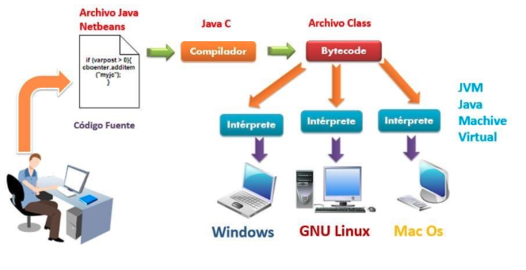

# Introducción a los Lenguajes Orientado a Objetos (LOO)

## Características

|| Java | Python |
| -- | -- | -- |
| **Performance**  | (+) es compilado e interpretado | (-) más lento que Java, por ser interpretado |
| **Legibilidad**  | (-) más verboso    | (+) claro, legible y breve |
| **Colaboración** | (+) gran comunidad y librerías | (+) gran comunidad y librerías |
| **Contratación** | (+) gran demanda   | (+) gran demanda |
| **Aprendizaje**  | (-) nivel medio    | (+) más fácil de aprender, técnica de codificación intuitiva |
| **Tipado**       | (?) estático, comprobación de tipos en tiempo de compilación | (?) dinámico, comprobación de tipos en tiempo de ejecución. Frecuencia de errores |
| **Paradigma**    | (+) POO y multipropósito       | (+) POO y multipropósito |

**Conclusión**: Java es más rápido, pero Python es más simple. En ambos, la arquitectura es neutral (multiplataforma), no hay GOTO tampoco punteros

* [Python vs Java](https://radixweb.com/blog/python-vs-java)
* [Python vs Java](https://jaydevs.com/python-vs-java/)

  

## IDE

* Es una aplicación que provee un entorno de desarrollo de software con diversas herramientas integradas:
  * editor de código con resaltador de sintaxis.
  * compilador.
  * depurador.
  * terminal.
  * control de versiones.
  * etc.

* IDEs:
  * Eclipse
  * Sublime Text 3
  * IntelliJ IDEA / PyCharm
  * [**Visual Studio Code**](https://code.visualstudio.com/)

## Instalación

=== "java"

```sh
java --version  # si te muestra versión está instalado
# Si no está instalado, ir a https://learn.microsoft.com/es-es/java/openjdk/download#openjdk-21 y bajar la versión correspondiente al SO
```

* Extensiones para VSC: Extension Pack for Java

=== "python"

```sh
python --version  # si muestra versión está instalado
# Si no está instalado:

WINDOWS

# 01. Ir a python.org/downloads y bajar la versión según SO
# 02. Ejecutar el instalador: sig, sig, sig (agregar Python al PATH)
# 03. Validar que está en el PATH
# 04. python --version
# 05. Si no existe archivo pip.ini en c:\users\id_usuario\pip crearlo
# 06. Crear proyecto (mkdir <proy>) o clonarlo (git clone <url repo>)
# 07. Crear entorno virtual: python -m venv venv
# 08. Activar entorno virtual: . venv\scripts\activate
# 09. Instalar libreria: pip install <libname>
# 10. Instalar librerias: pip install -r requirements.txt 

LINUX
# 01 a 03 reemplazar por sudo apt install python3-pip
# 05 Si no existe archivo pip.conf en .config/pip crearlo
# 08. Activar entorno virtual: . venv\bin\activate
```

| Libs que no necesitan instalarse | |
| -- | -- |
| **sys**      | funciones y parámetros específicos del SO |
| **os**       | interfaz con el SO |
| **io**       | funciones para manejo de flujos de datos y archivos |
| **string**   | funciones con cadenas |
| **datetime** | funciones para fechas y tiempos |
| **calendar** | funciones de calendario |
| **math**     | funciones y constantes estadísticas |
| **random**   | generación de números pseudo-aleatorios |
| **unittest** | generación de tests unitarios |

* Extensiones para VSC: pylint, python, autopep8
* En settings (la ruedita del menú de la izquierda) settings y en la cajita de buscar, escribir formatOnSave y tildar la opción  

## Hola Mundo

|| Java | Python |
| -- | -- | -- |
| **Edición** | `public class HolaMundo { public static void main(String[] args){ System.out.println("Hola Mundo"); }}` | `print('Hola mundo')` |
| **Compilación** | `javac HolaMundo.java` | |
| **Ejecución**   | `java HolaMundo`       | |

## Comentarios

=== "java"

  ```java
  // Esto es un comentario unilínea

  /* Esto es un comentario
      multilíneas
  */

  /** 
   *  Esto es un comentario para documentar con javadoc
   *  mediante metadata
   *  @param cont contador, 
   *  @return el promedio, 
   *  @throws NumberFormatException, 
   *  @author Pablo Pandolfo, 
   *  @version 1.0
   */
  ```

=== "python"

  ```py
  # Esto es un comentario unilína

  """ 
  Esto es un comentario
  multilíneas
  """
  ```

## Entrada por terminal

=== "java"

  ```java
  Scanner in = new Scanner(System.in);
  in.nextLine();       // lee una línea de entrada
  in.next();           // lee una sola palabra
  in.nextInt();        // lee un entero
  in.nextDouble();     // lee número de coma flotante
  in.hasNext();        // si hay o no otra palabra
  in.hasNextInt();     // si hay o no otro entero
  in.hasNextDouble();  // si hay o no otro número de coma flotante
  ```

=== "python"

  ```py
  age = input('Cual es tu edad? ')  # siempre devuelve una cadena
  ```

## Salida por terminal

=== "java"

  ```java
  System.out.print("Hola mundo");
  System.out.println("Hola mundo");

  Double x = 10000.0/3.0;
  System.out.println(x);          // 3333.3333333
  System.out.printf("%8.2f", x);  // 3333.33
  System.out.printf("%,.2f", x);  // 3,333.33

  String.format(“Hola, %s. El año que viene tendrás %d”, nombre, edad);
  ```

=== "python"

  ```py
  # print(dato1, ..., sep=' ', end='\n', file=sys.stdout)
  print('Tu edad es', age)
  print('Tu edad es', age, sep='->')
  print('Tu edad es', age, end='!\n')

  dia = 9
  mes = "noviembre"
  print(f"Mi cumple es el {dia} de {mes}")
  ```

## Palabras claves

=== "java"

  ```java
  //TODO
  public static void main(String[] args) {

  }  
  ```

=== "python"

  ```py
  import keyword

  print(keyword.kwlist)
  ```

## Tipos de datos primitivos

=== "java"

* **Tipado estático**: requiere declarar las variables con su tipo de datos

    ```java
    byte enteroByte   = 1;    // 1 byte
    short enteroShort = 2;    // 2 bytes
    int enteroInt     = 4;    // 4 bytes
    long enteroLong   = 8;    // 8 bytes
    float realFloat   = 4.5;  // 4 bytes
    double realDouble = 8.5;  // 8 bytes
    boolean logico    = true; // 1 byte
    char caracter     = 'a';  // 2 bytes
    ```

    

=== "python"

* **Tipado dinámico**: una variable puede tomar valores de distinto tipo

    ```py
    entero = 5
    real = 3.14
    string = 'Hola'
    boolean = True
    no_definido = None

    print(type(entero), type(real), type(string), type(boolean), type(no_definido))
    print(entero, real, string, boolean, no_definido)

    # Conversiones
    print(int('12'))
    print(int(True))

    print(float('3.14'))
    print(float(True))

    print(str(3.14))
    print(str(True))

    print(bool(0))
    print(bool('3.14'))
    print(bool('Hola'))
    ```

## Operadores

| | Java | Python |
| -- | -- | -- |
| **Aritméticos**  | {+, -, *, /, %}          | {+, -, \*, /, //, %, **} |
| **Relacionales** | {==, !=, >, >=, <, <=}   | {==, !=, >, >=, <, <=} |
| **Lógicos**      | {&&, \|\|, !}            | {and, or, not} |
| **Asignación**   | {=, +=, -=, \*=, /=, %=} | {=, +=, -=, \*=, /=, %=, \*\*=, //=} |
| **Condicional**  | `(x<y)? x : y;`          | `(x<y)? x : y` |
| **Otros**        | {[], ., (), (refundición), new, instanceof} | {is, is not, in, in not} |

## Cadenas

=== "java"

* Los String son instancias de la clase java.lang.String.
* El compilador trata a los String como si fuesen tipos del lenguajes
* Son inmutables.

  ```java
  String saludo = "Hola";
  String otroSaludo = new String("Como andás?");

  saludo.length();
  saludo.charAt(0);
  saludo.substring(0,2);
  saludo.compareTo("adios");
  saludo.equals("Hol");
  saludo.split("o");
  saludo.trim();
  saludo.indexOf("a");
  saludo.indexOf("a", 2);
  saludo.toLowerCase();
  saludo.toUpperCase();
  saludo.equalsIgnoreCase("h");
  saludo.endsWith("la");
  ```

=== "python"

  ```py
  print('python')
  print("123")
  print('True')

  print('Hola', '\n', 'Mundo')  # salto de linea
  print('Hola', '\t', 'Mundo')  # tabulador

  # Acceso a caracteres
  cadena = 'python'
  print(cadena[0])
  print(cadena[-1])
  print(cadena[1:4])
  print(cadena[1:1])
  print(cadena[2:])
  print(cadena[:-2])
  print(cadena[:])
  print(cadena[0:6:2])

  cadena2 = 'Lenguaje'
  print(cadena + cadena2)      # concatena. Error cadena+numero
  print(cadena * 3)            # concatena n copias de cadena
  print('yth' in cadena)       # True si 'yth' contenida en cadena
  print('pepe' not in cadena)  # True si 'pepe' no esta contenida en cadena

  # utilizan orden en ASCII
  print(cadena == cadena2)
  print(cadena != cadena2)
  print(cadena > cadena2)
  print(cadena >= cadena2)
  print(cadena < cadena2)
  print(cadena <= cadena2)

  # Funciones de cadenas
  print(len(cadena))
  print(min(cadena))
  print(max(cadena))

  print(cadena.count('t'))
  print(cadena.find('abc'))

  print(cadena.upper())
  print(cadena.lower())
  print(cadena.capitalize())
  print(cadena.title())

  print(cadena.isdigit())
  print(cadena.isalpha())
  print(cadena.isalnum())

  print(cadena.split('y'))
  print(cadena.index('yt'))
  print(cadena.strip()) #trimea
  print(cadena.replace('ho', 'zzzz'))
  print('Un {} vale {} {}'.format('U$', 1000, '$'))
  ```

## Arreglos

=== "java"

* Todo arreglo es de un tipo o una clase.
* Se los instancia con el operador new
* Son “zero-based”

  

    ```java
    import java.util.Arrays;

    char[] caracteres;
    String[] palabras = new String[10];
    float[] arreglo = {2, 4, 6};
    int[][] matriz = {{1, 7}, {3, 4}};
    caracteres = new char[]{‘a’, ‘1’};
    palabras[2] = "chango";

    int [] arreglo = new int [10000];
  
    // Operaciones con arreglos
    Arrays.sort(arreglo); 
    Arrays.binarySearch(arreglo, 3);
    Arrays.fill(arreglo, 3);
    ```

## Estructuras de control - condicionales (if)

=== "java"

  ```java
  int a = 10;
  if (a == 10)
    System.out.println("Es 10");
  else
    System.out.println("No es 10");
  
  int i = 2;
  switch (i) {
    case 1:{ System.out.println("Es 1"); break; }
    case 2:{ System.out.println("Es 2"); break; }
    case 3:{ System.out.println("Es 3"); break; }
    default: System.out.println("No es 1 ni 2 ni 3");
  }
  ```

=== "python"

  ```py
  a = 10
  if a == 10:
      print("Es 10")
  else:
      print("No es 10")

  edad = 14
  if edad < 18:
      print("Menor")
  elif edad >= 65:
      print("Jubilado")
  else:
      print("Activo")

  # En python no existe el switch
  ```

## Estructuras de control - bucles indeterminados (while)

=== "java"

  ```java
  int x = 0;
  while (x < 3) { 
    System.out.println(x);
    x += 1;
  }
  ```

=== "python"

  ```py
  x = 0
  while x < 3:
      print(x)
      x += 1

  x = 0
  while True:
      print(x)
      if x == 2:
          break
      x += 1
  ```

## Estructuras de control - bucles determinados (for)

=== "java"

  ```java
  for (int i=0; i < 8; i++)
    System.out.println(i);

  String[] arreglo = {"oi", "ola", "hola"};
  for (String palabra: arreglo) 
    System.out.println(palabra);
  ```

=== "python"

  ```py
  palabra = 'python'
  for letra in palabra:
      print(letra)

  for i in range(3):
      print(i)

  for i in range(3):
      if i == 1:
          continue
      print(i)

  for i in range(1, 10, 2):  # el 2 es un salto
      print(i, end=', ')
  ```

## Funciones

=== "java"

  ```java
  public class Calculo {

    public static void main(String [] args) {
      System.out.println(Calculo.sumar(2.5, 3.3));
    }

    public static double sumar(double a, double b) {
      return a + b;
    }

  }
  ```

=== "python"

  ```py
  # pueden tener parámetros/argumentos
  # el pasaje es siempre por referencia
  def sumar(a, b=3):      # declaración con argumento por defecto
      return a + b        # cuerpo

  print(sumar(1, 2))      # argumentos posicionales
  print(sumar(b=2, a=1))  # argumentos nominales
  print(sumar(1))
  ```

## Argumentos variables (varargs)

=== "java"

  ```java
  public static void main(String[] args) {
    System.out.println(sum_all(1));
    System.out.println(sum_all(1, 2));
    System.out.println(sum_all(1, 2, 3));
  }

  public static double sum_all(Double...varargs) {
    double suma = 0;
    for (Double v : varargs)
      suma += v;
    return suma;
  }
  ```

=== "python"

  ```py
  def sum_all(*varargs):
      suma = 0
      for v in varargs:
          suma += v
      return suma

  print(sum_all(1))
  print(sum_all(1, 2))
  print(sum_all(1, 2, 3))
  ```

## Funciones recursivas

=== "python"

  ```py
  def hanoi(n, inc='1', temp='2', fin='3'):
      if n > 0:
          hanoi(n-1, inc, fin, temp)
          print('se mueve de torre', inc, 'a torre', fin)
          hanoi(n-1, temp, inc, fin)

  hanoi(5)
  ```

## Documentar una función/método

* Para ayudar en el trabajo en equipo
* Especialmente útil en aplicaciones complejas

=== "java"

  ```java
  /**
   *  Calcula el área de un cuadrado
      elevando al cuadrado el lado pasado
      por parámetro
  */
  public static double areaCuadrado(double lado) {
      return lado * lado;
  }
  ```

=== "python"

  ```py
  def area_cuadrado(lado):
    """ Calcula el área de un cuadrado
    elevando al cuadrado el lado pasado
    por parámetro """
    return "El area es: " + str(lado * lado)

  print(area_cuadrado.__doc__)   # imprime comentario
  help(area_cuadrado)            # imprime mas detalle
  ```
