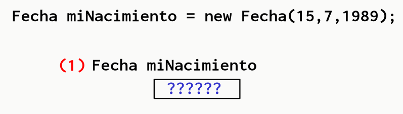
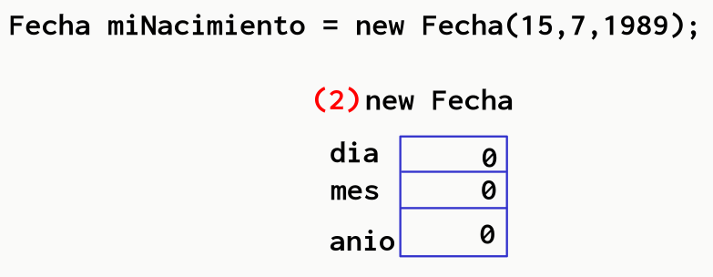
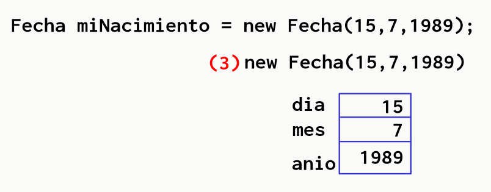
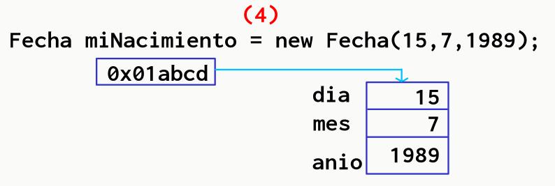
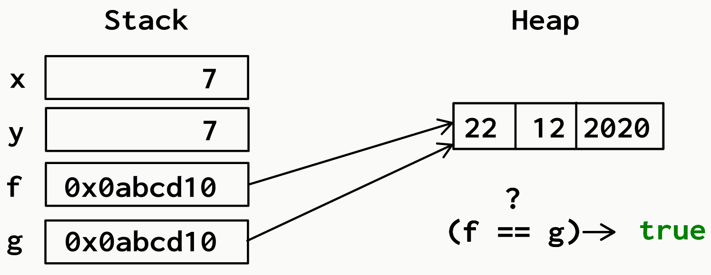
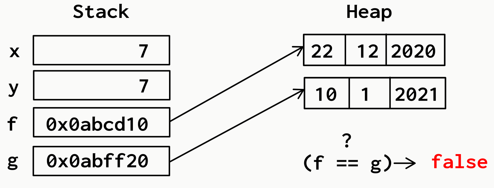
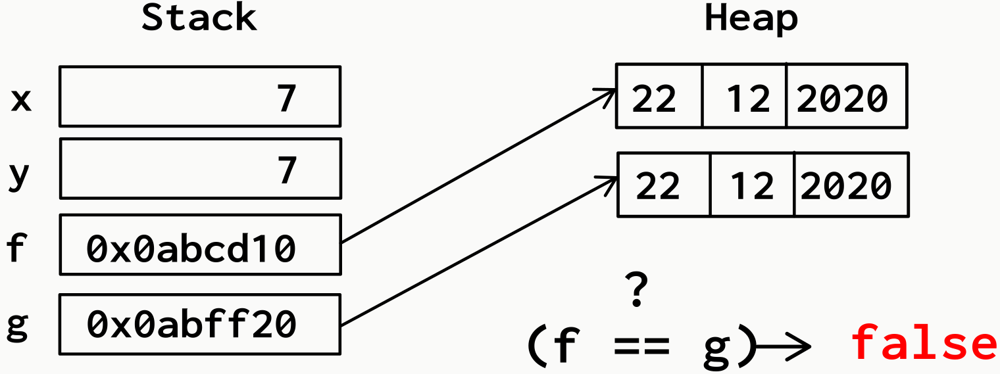
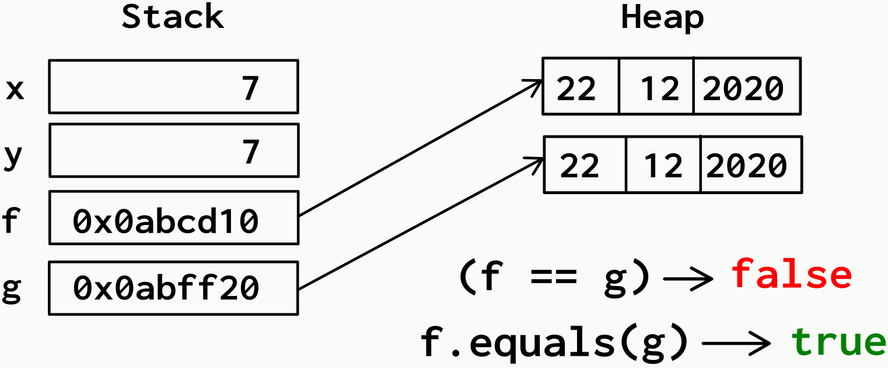
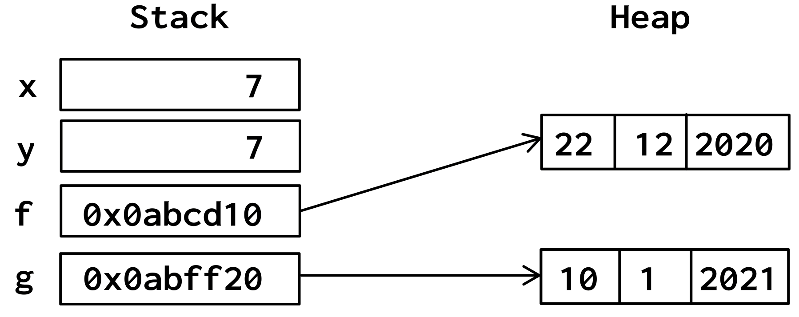
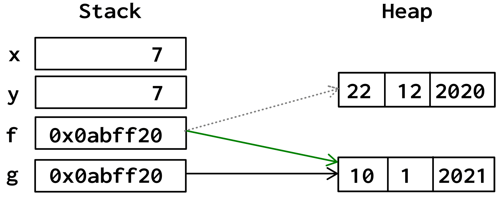

# Encapsulamiento

## Definición

* **Encapsular**: acción de poner juntas ciertas cosas dado que hay una razón para ello
* En la POO aquellas cosas serán los **datos** y los **métodos** que operan sobre esos datos
* Mediante el **encapsulamiento** se crean las entidades que se desean manejar en los sistemas
* Sentidos:

  |||
  | -- | -- |
  | **especialización** | el propio objeto es quien sabrá cómo manejar los datos que contiene, y lo hará con los métodos asociados a sus datos |
  | **completitud** |  permite descansar en que la abstracción construida representa a la entidad, y a aquella **responsabilidad** que tendrá asignada dentro de los sistemas |

## Interfaz pública

* Se define como **interfaz pública** de una clase, al conjunto de responsabilidades que los objetos de esa clase exponen o brindan al exterior de la misma, al universo
* Interesa mucho más **la interfaz pública de los objetos** que sus **representaciones internas** y datos asociados

## Ocultamiento de información

* Es utilizar las técnicas que brinda el lenguaje para abstraer a los módulos cliente de los detalles de implementación
* Indica **buenas prácticas de programación**: "necesito de este objeto, pero no me importa cómo resuelva sus **responsabilidades** mientras lo haga por mí"
* Reglas:

  | Encapsulamiento | Ocultamiento de información |
  | -- | -- |
  | Ubicar los datos y las operaciones que trabajan sobre esos datos en la misma clase | No exponer atributos |
  | Utilizar diseño guiado por las responsabilidades para determinar la agrupación de datos y operaciones dentro de clases | No exponer diferencia entre atributos propiamente dichos y atributos calculados |
  |  | No exponer la estructura interna de una clase |
  |  | No exponer detalles de implementación de una clase |

## Paquete

=== "java"

* Directorios donde se almacenarán artefactos java (clases, interfaces, enumerados) relacionados entre sí
* Ejemplos: **java.lang**, **java.io**, **java.sql**, **java.util**, etc.

  ```java
  package calculos;

  public class CalculosGenerales {

    public static double sumar(double a, double b) {
      return a + b;
    }

  }
  ```

  ```java
  package demos;
  import calculos.*;

  public class UsoCalculo {

    public static void main(String [] args) {
      System.out.println(CalculosGenerales.sumar(2.5, 3.4));
    }

  }
  ```

=== "python"

* Directorios donde se almacenarán módulos (archivos con extensión .py) relacionados entre sí
* Se crea una carpeta con un archivo \_\_init__.py

  ```py
  # Módulo calculos.py
  def sumar(op1, op2):
    return op1 + op2
  ```

  ```py
  import calculos as calc

  print(calc.sumar(2.5, 3.4))

  # Otra forma:
  # from calculos import *
  # print(sumar(2.5, 3.4))
  ```

## Clase

* Modelo (plantilla, molde) donde se redactan las características comunes de un grupo de objetos
* Tiene como responsabilidad crear objetos del mismo tipo
* Se compone de una declaración y un cuerpo

=== "java"

* Cada clase, excepto la clase Object, es una extensión (subclase), de una sola clase ya existente (herencia simple)
* Si una clase no declara explícitamente su superclase, entonces se asume que extiende a la clase Object

  ```java
  public class Auto {

    // atributos del objeto
    private int ruedas;
    private boolean enMarcha;

    // constructor: inicializa los atributos del objeto
    public Auto() {
      this(4);
    }

    // otro constructor, sobrecarga de constructores
    // this: objeto actual
    public Auto(int ruedas) {
      this.ruedas = ruedas;
      this.enMarcha = false;
    }

    // métodos
    public void arrancar() {
      this.enMarcha = true;
    }

    public String getEstado() {
      return (this.enMarcha)? "En marcha" : "Parado";
    }

  }
  ```

  ```java
  public class DemoAuto {

    public static void main(String [] args) {
      Auto auto = new Auto();
      System.out.prinltn(auto.getEstado());
      auto.arrancar();
      // auto.enMarcha = false es un error porque está encapsulado
      System.out.prinltn(auto.getEstado());
    }

  }
  ```

=== "python"

  ```py
  class Auto:
    
    # constructor: inicializa los atributos del objeto
    # self: objeto actual
    def __init__(self, ruedas=4):
      # atributos del objeto
      # prefijo __ significa private
      self.__ruedas = ruedas
      self.__enmarcha = False

    # métodos
    def arrancar(self):
      self.__enmarcha = True
    
    def get_estado(self):
      if self.__enmarcha:
        return 'En marcha'
      else:
        return 'Parado'
    
  auto = Auto()
  print(auto.get_estado())
  auto.arrancar()
  auto.__enmarcha = False    # no hay error, tampoco modifica porque está encapsulado
  print(auto.get_estado())
  ```

## Modificadores

=== "java"

  | Modificadores de clase | | Ejemplo |
  | -- | -- | -- |
  | **public**   | accedidas por todos | public class Auto {} |
  | **package**  | accedidas dentro del paquete donde fueron declaradas | class Auto {} |
  | **abstract** | no se pueden instanciar | public abstract class Vehiculo {} |
  | **final**    | no se pueden extender | public final class Auto {} |

  | Modificadores de atributos | | Ejemplo |
  | -- | -- | -- |
  | **static** | variables de clase (variable compartida) | private static int contador; |
  | **final**  | constantes                               | private static final double PI = 3.14; |

  | Modificadores de métodos | | Ejemplo |
  | -- | -- | -- |
  | **abstract**     | no tiene implementación. Debe ser miembro de una clase abstracta | public abstract double getSalary(); |
  | **static**       | no necesita de un objeto que lo controle. Lo invoca la clase | public static double pow(base, exp) {} |  
  | **final**        | no puede ser redefinido por las subclases | public final String toLowerCase() {} |
  | **native**       | está implementado en otro lenguaje | public native void diHola() {} |
  | **synchronized** | permite que múltiples objetos invoquen el mismo método con exclusión mutua | public synchronized void imprimir() {} |

=== "python"

  ```py
  # Clase pública
  class Perro:

    # atributo de clase (comunes para todos los objetos)
    especie = 'mamifero'

    # constructor
    def __init__(self, nombre, raza):
      # atributos de instancia
      # self: representa la instancia de la clase
      # __atributo: accesibilidad privada
      self.__nombre = nombre
      self.__raza = raza

    # métodos de instancia: acceder y modificar atributos del objeto y acceder a otros métodos
    # método de instancia sin parámetros
    def ladra(self):
      print('Guau')

    # método de instancia con parámetros
    def camina(self, pasos):
      print(f"Caminando {pasos} pasos")

    # método de clase: pueden modificar los atributos de la clase
    @classmethod
    def metodo_clase(cls):
      return cls

    # método estático: no pueden modificar el estado ni de la clase ni de la instancia
    @staticmethod
    def metodo_estatico():
      return "Método estático"

  # Objeto de la clase Perro
  mi_perro = Perro('Toby', 'Bulldog')
  print(Perro.especie)
  mi_perro.ladra()
  mi_perro.camina(10)
  Perro.metodo_clase()
  Perro.metodo_estatico()
  ```

## Convenciones de nombres

| | UpperCamelCase | LowerCamelCase | LowerSnackCase | UpperSnackCase |
| -- | -- | -- | -- | -- |
| **Paquete**    |             |                | calculos_generales |           |
| **Clase**      | AutoJapones |                |                    |           |
| **Atributo**   |             | J: lastName    | P: last_name       |           |
| **Método**     |             | J: getSalary() | P: get_salary()    |           |
| **Constantes** |             |                |                    | NUMERO_PI |

## Métodos Getters y Setters (accesores)

* Bajo ciertas circunstancias puede ser necesario cambiar algún valor interno de un objeto
* Es importante proporcionar un mecanismo para poder hacerlo sin romper el encapsulamiento, o sea, sin hacer públicos algunos -o todos- sus miembros
* Los **accesores** serán los que nos permitan acceder a esos miembros privados de una manera controlada

  ||| Sirven para ... |
  | -- | -- | -- |
  | **Getters** | obtener    | obtener el valor de un atributo |
  | **Setters** | establecer | establecer el valor de un atributo |

* **Estructura Getter**:

  ```java
  public Integer getEdad() {
    return this.edad;
  }
  ```

* **Estructura Setter**:

  ```java
  public void setEdad(Integer edad) {
    this.edad = edad;
  }
  ```

* Al definir una clase, se define la complejidad de éstos métodos y qué tan directamente se permite el acceso a los miembros de la misma

## Métodos privados

* Se declaran métodos privados cuando:
  * Demasiado cerca de la implementación
  * Requieren un determinado orden de llamada
  * Se utilizan en las operaciones de la propia clase
* La base del encapsulamiento se basa en que determinados métodos o atributos **no deben ser de acceso público por seguridad de manejo de datos**

=== "java"

  ```java
  public class Laptop {

    private Color color;
    private String marca;
    
    public void encender() {...}
    public void apagar() {...}
    public void reiniciar() {...}
    private void cambiarRAM() {...}
    private void cambiarHDD() {...}
  }
  ```

=== "python"

  ```py
  class Laptop {

    def __init__(self, color, marca):
      self.color = color
      self.marca = marca
    
    def encender(self):
      pass

    def apagar(self):
      pass

    def reiniciar(self):
      pass

    def __cambiarRAM(self):
      pass

    def __cambiarHDD(self):
      pass

  }
  ```

### Sintaxis básica

=== "java"

  

  

=== "python"

  

  ```py
  import random

  class Tambor:
      
      def __init__(self):
          self.__posicion = 0

      def girar(self):
          self.__posicion = random.randint(1, 3)

      def mostrar(self):
          return "[" + str(self.__posicion) + "]"

  class Tragamonedas:
      
      def __init__(self):
          self.__t1 = Tambor()
          self.__t2 = Tambor()
          self.__t3 = Tambor()

      def activar(self):
          self.__t1.girar()
          self.__t2.girar()
          self.__t3.girar()

      def mostrar(self):
          return self.__t1.mostrar() + self.__t2.mostrar() + self.__t3.mostrar()
          
      def get_gano(self):
          return self.__t1.mostrar() == self.__t2.mostrar() == self.__t3.mostrar()

  tambor = Tambor()
  tambor.girar()
  print(tambor.mostrar())
  tgm = Tragamonedas()
  tgm.activar()
  print(tgm.mostrar())
  print(tgm.get_gano())
  ```

## Enums

* Para declarar variables con un conjunto restringido de valores

### Sin representación

=== "java"

  ```java
  public enum Talle {
    MINI, 
    MEDIANO, 
    GRANDE, 
    EXTRA_GRANDE;
  }
  ```

  ```java
  Talle talle = Talle.MEDIANO;
  ```

### Con representación

  ```java
  public enum Talle {
    MINI("S"), 
    MEDIANO("M"), 
    GRANDE("X");
    private representacion;
    private Talle(String representacion) { 
      this.setRepresentacion(representacion); 
    }
  }
  ```

## Pruebas Unitarias

* Evaluar si el funcionamiento de cada uno de los métodos de la clase se comporta como se espera
* El resultado de la prueba puede ser PASS o FAIL

=== "java"

  ```java
  public class Matematicas {
    
    public static int sumar(int op1, int op2) {
      return op1 + op2;
    }

  }
  ```

  ```java
  import static org.junit.jupiter.api.Assertions.assertEquals;
  import org.junit.jupiter.api.Test;
  public class SumadorTest {

    @Test
    public testSuma1Y2() {
      assertEquals(3, Matematicas.sumar(1, 2));
    }

  }
  ```

=== "python"

```py
class Matematicas:

  @staticmethod
  def sumar(op1, op2):
    return op1 + op2
```

```py
import unittest

class SumadorTest(unittest.TestCase):

  def test_suma_1_y_2(self):
    self.assertEquals(3, Matematicas.sumar(1, 2))
    
  def test_suma_2_y_2(self):
    self.assertEquals(5, Matematicas.sumar(2, 2))

if __name__ == '__main__':
    unittest.main()
```

## Gestión del ciclo de vida de las pruebas

| Anotación JUnit | Prefijo/Decorador Unittest | Descripción |
| -- | -- | -- |
| **@Test**         | **test_xxx**              | denota que es un método test |
| **@BeforeEach**   | **setUp(self)**           | denota que el método se va a ejecutar antes de cada test (precondición) |
| **@AfterEach**    | **tearDown(self)**        | denota que el método se va a ejecutar después de cada test (postcondición) |
| **@BeforeAll**    | **setUpClass(cls)**       | denota que el método se va a ejecutar antes de la suite de tests |
| **@AfterAll**     | **tearDownClass(cls)**    | denota que el método se va a ejecutar después de la suite de tests |
| **@Disabled**     | **@unittest.skip('xxx')** | usado para deshabilitar una clase test o un método test |
| **@RepeatedTest** |                           | para repetir pruebas. Ejemplo: @RepeatedTest(10) |

## Referencias

* Es la dirección de memoria en la que se encuentra almacenado un **objeto**
* Todos los objetos se manipulan a través de referencias
* Una referencia **apunta** a un objeto que se encuentra en la memoria **HEAP**
* Las variables de **tipo primitivo** (int, double, boolean, char) **almacenan el valor** propiamente dicho
* Las variables que **no son de tipo primitivo almacenan una referencia** a una instancia de ese tipo de objeto

  
  
  
  

* Asignación de referencias. Ejemplo:

  ```java
  int x = 7;
  int y = x;
  Fecha f = new Fecha(22, 12, 2020);
  Fecha g = f;
  ```

  

* Reasignación de g a un nuevo objeto Fecha

  ```java
  int x = 7;
  int y = x;
  Fecha f = new Fecha(22,12,2020);
  Fecha g = new Fecha(10,1,2021);
  ```

  

* Reasignación de g a un nuevo objeto Fecha

  ```java
  int x = 7;
  int y = x;
  Fecha f = new Fecha(22,12,2020);
  Fecha g = new Fecha(22,12,2020);
  ```

  {width=55%}

## Operador == vs Método equals

* **==**: realiza una comparación equivalencias. Dadas dos referencias **x** e **y**, **x == y** devuelve **true** si y solo si **x** e **y** refieren al mismo objeto
* **equals**: para poder comparar dos objetos a fin de saber si son iguales, debemos proveer (sobrescribir) el método **equals**

  ```java
  @Override
  public boolean equals(Object obj){
      if(this == obj) //pregunta si las referencias son iguales
          return true;
      if(obj == null) //pregunta si el parámetro es null
          return false;
      if(this.getClass() != obj.getClass() //pregunta si los objetos 
          return false;                    //son de distinta clase
      Fecha f = (Fecha) obj; // Casteo de obj a tipo Fecha
      //finalmente compara uno a uno los atributos
      return (this.dia == f.dia && this.mes == f.mes && this.anio == f.anio)
  }
  ```

  ```java
  int x = 7;
  int y = x;
  Fecha f = new Fecha(22,12,2020);
  Fecha g = new Fecha(22,12,2020);
  ```

  

## Garbage Collector

* Objetos que quedan desreferenciados

  ```java
  int x = 7;
  int y = x;
  Fecha f = new Fecha(22,12,2020);
  Fecha g = new Fecha(10,01,2021);
  ```

  

* Objetos que quedan desreferenciados.

  ```java
  int x = 7;
  int y = x;
  Fecha f = new Fecha(22,12,2020);
  Fecha g = new Fecha(10,01,2021);
  f = g;
  ```

  

* Objetos que quedan desreferenciados.

  ```java
  int x = 7;
  int y = x;
  Fecha f = new Fecha(22,12,2020);
  Fecha g = new Fecha(10,01,2021);
  f = g;
  ```

  ![La Fecha [22/12/2020] queda desreferenciada e inaccesible.](img/gc3.png)

## Usos de la referencia this

* Resolución de ambigüedades entre parámetros y atributos
* Pasaje del objeto actual como parámetro a otro método
* Invocación explícita de métodos de la propia clase
* Invocación del constructor de la clase actual

  ```java
  class Circulo {

    private double radio;

    public Circulo() {
      this(1.0);
    }

    public Circulo(double radio) { 
      this.setRadio(radio);
    }

    public void setRadio(double radio) {
      if(radio <=0)
        throw new Error("Radio Inválido");
      this.radio = radio;
    }
    
    public void setDiametro(double diametro) {
      this.setRadio(diametro/2);
    }

    public double getRadio() { 
      return this.radio;
    }

    public double getDiametro(){
      return this.getRadio() * 2;
    }

    public double getPerimetro() {
      return this.getDiametro() * Math.PI; 
    }
        
    public double getArea() {
      return Math.PI * Math.pow(this.getRadio(),2);
    }

  }
  ```
