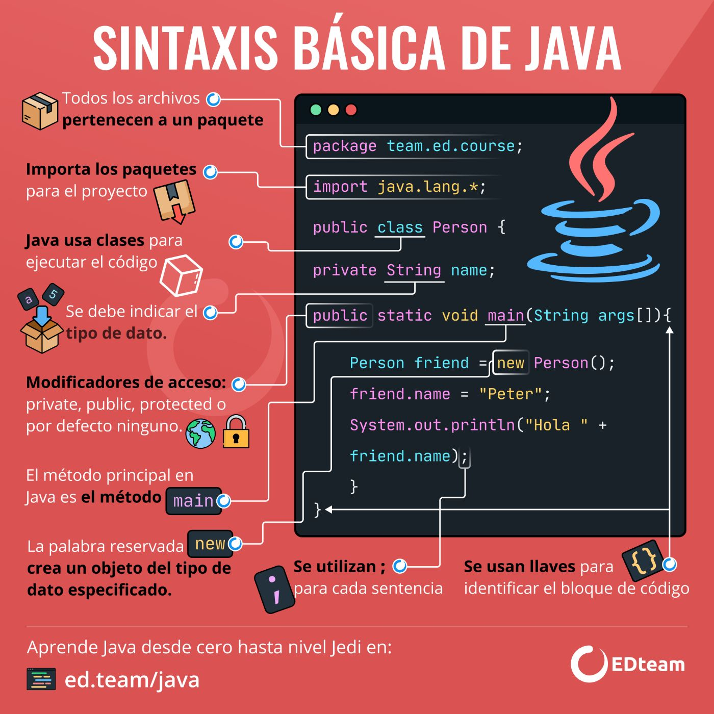
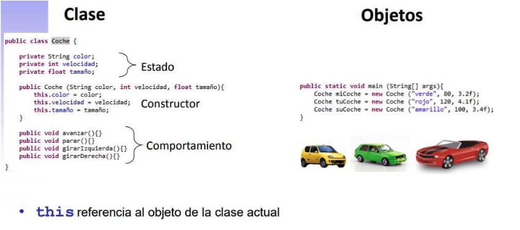

# Encapsulamiento

## Paquete

=== "java"

* Directorios donde se almacenarán artefactos java (clases, interfaces, enumerados) relacionados entre sí
* Ejemplos: **java.lang**, **java.io**, **java.sql**, **java.util**, etc.

  ```java
  package calculos;

  public class CalculosGenerales {

    public static double sumar(double a, double b) {
      return a + b;
    }

  }
  ```

  ```java
  package demos;
  import calculos.*;

  public class UsoCalculo {

    public static void main(String [] args) {
      System.out.println(CalculosGenerales.sumar(2.5, 3.4));
    }

  }
  ```

=== "python"

* Directorios donde se almacenarán módulos (archivos con extensión .py) relacionados entre sí
* Se crea una carpeta con un archivo \_\_init__.py

  ```py
  # Módulo calculos.py
  def sumar(op1, op2):
    return op1 + op2
  ```

  ```py
  import calculos as calc

  print(calc.sumar(2.5, 3.4))

  # Otra forma:
  # from calculos import *
  # print(sumar(2.5, 3.4))
  ```

## Clase

* Modelo (plantilla, molde) donde se redactan las características comunes de un grupo de objetos
* Tiene como responsabilidad crear objetos del mismo tipo
* Se compone de una declaración y un cuerpo

=== "java"

* Cada clase, excepto la clase Object, es una extensión (subclase), de una sola clase ya existente (herencia simple)
* Si una clase no declara explícitamente su superclase, entonces se asume que extiende a la clase Object

  ```java
  public class Auto {

    // atributos del objeto
    private int ruedas;
    private boolean enMarcha;

    // constructor: inicializa los atributos del objeto
    public Auto() {
      this(4);
    }

    // otro constructor, sobrecarga de constructores
    // this: objeto actual
    public Auto(int ruedas) {
      this.ruedas = ruedas;
      this.enMarcha = false;
    }

    // métodos
    public void arrancar() {
      this.enMarcha = true;
    }

    public String getEstado() {
      return (this.enMarcha)? "En marcha" : "Parado";
    }

  }
  ```

  ```java
  public class DemoAuto {

    public static void main(String [] args) {
      Auto auto = new Auto();
      System.out.prinltn(auto.getEstado());
      auto.arrancar();
      // auto.enMarcha = false es un error porque está encapsulado
      System.out.prinltn(auto.getEstado());
    }

  }
  ```

=== "python"

  ```py
  class Auto:
    
    # constructor: inicializa los atributos del objeto
    # self: objeto actual
    def __init__(self, ruedas=4):
      # atributos del objeto
      # prefijo __ significa private
      self.__ruedas = ruedas
      self.__enmarcha = False

    # métodos
    def arrancar(self):
      self.__enmarcha = True
    
    def get_estado(self):
      if self.__enmarcha:
        return 'En marcha'
      else:
        return 'Parado'
    
  auto = Auto()
  print(auto.get_estado())
  auto.arrancar()
  auto.__enmarcha = False    # no hay error, tampoco modifica porque está encapsulado
  print(auto.get_estado())
  ```

## Modificadores en Java

| Modificadores de clase | | Ejemplo |
| -- | -- | -- |
| **public**   | accedidas por todos | public class Auto {} |
| **package**  | accedidas dentro el paquete donde fueron declaradas | class Auto {} |
| **abstract** | no se pueden instanciar | public abstract class Vehiculo {} |
| **final**    | no se pueden extender | public final class Auto {} |

| Modificadores de atributos | | Ejemplo |
| -- | -- | -- |
| **static** | variables de clase (variable compartida) | private static int contador; |
| **final**  | constantes                               | private static final double PI = 3.14; |

| Modificadores de métodos | | Ejemplo |
| -- | -- | -- |
| **abstract**     | no tiene implementación. Debe ser miembro de una clase abstracta | public abstract double getSalary(); |
| **static**       | no necesita de un objeto que lo controle. Lo invoca la clase | public static double pow(base, exp) {} |  
| **final**        | no puede ser redefinido por las subclases | public final String toLowerCase() {} |
| **native**       | está implementado en otro lenguaje | public native void diHola() {} |
| **synchronized** | permite que múltiples objetos invoquen el mismo método con exclusión mutua | public synchronized void imprimir() {} |

## Convenciones de nombres

| | UpperCamelCase | LowerCamelCase | LowerSnackCase | UpperSnackCase |
| -- | -- | -- | -- | -- |
| **Paquete**    |             |                | calculos_generales |           |
| **Clase**      | AutoJapones |                |                    |           |
| **Atributo**   |             | J: lastName    | P: last_name       |           |
| **Método**     |             | J: getSalary() | P: get_salary()    |           |
| **Constantes** |             |                |                    | NUMERO_PI |

## Métodos privados

* Se declaran métodos privados cuando:
  * Demasiado cerca de la implementación
  * Requieren un determinado orden de llamada
  * Se utilizan en las operaciones de la propia clase
* La base del encapsulamiento se basa en que determinados métodos o atributos **no deben ser de acceso público por seguridad de manejo de datos**

=== "java"

  ```java
  public class Laptop {

    private Color color;
    private String marca;
    
    public void encender() {...}
    public void apagar() {...}
    public void reiniciar() {...}
    private void cambiarRAM() {...}
    private void cambiarHDD() {...}
  }
  ```

=== "python"

  ```py
  class Laptop {

    def __init__(self, color, marca):
      self.color = color
      self.marca = marca
    
    def encender(self):
      pass

    def apagar(self):
      pass

    def reiniciar(self):
      pass

    def __cambiarRAM(self):
      pass

    def __cambiarHDD(self):
      pass

  }
  ```

### Sintaxis básica

=== "java"

  

  

=== "python"

  

  ```py
  import random

  class Tambor():

      posicion = 0

      def girar(self):
          r = random.randint(1, 8)
          self.posicion = r

      def mostrar(self):
          return "[" + str(self.posicion) + "]"

  class Tragamonedas():
    
      t1 = Tambor()
      t2 = Tambor()
      t3 = Tambor()

      def activar(self):
          self.t1.girar()
          self.t2.girar()
          self.t3.girar()

      def mostrar(self):
          return self.t1.mostrar() + self.t2.mostrar() + self.t3.mostrar()

  tambor = Tambor()
  tambor.girar()
  print(tambor.mostrar())
  tgm = Tragamonedas()
  tgm.activar()
  print(tgm.mostrar())
  ```

## Enums

* Para declarar variables con un conjunto restringido de valores

### Sin representación

=== "java"

  ```java
  public enum Talle {
    MINI, 
    MEDIANO, 
    GRANDE, 
    EXTRA_GRANDE;
  }
  ```

  ```java
  Talle talle = Talle.MEDIANO;
  ```

### Con representación

  ```java
  public enum Talle {
    MINI(“S”), 
    MEDIANO(“M”), 
    GRANDE(“X”);
    private representacion;
    private Talle(String representacion) { 
      this.setRepresentacion(representacion); 
    }
  }
  ```

## Pruebas Unitarias

* Evaluar si el funcionamiento de cada uno de los métodos de la clase se comporta como se espera
* El resultado de la prueba puede ser PASS o FAIL

=== "java"

  ```java
  public class Matematicas {
    
    public static int sumar(int op1, int op2) {
      return op1 + op2;
    }

  }
  ```

  ```java
  import static org.junit.jupiter.api.Assertions.assertEquals;
  import org.junit.jupiter.api.Test;
  public class SumadorTest {

    @Test
    public testSuma1Y2() {
      assertEquals(3, Matematicas.sumar(1, 2));
    }

  }
  ```

=== "python"

```py
class Matematicas:

  @classMethod
  def sumar(op1, op2):
    return op1 + op2
```

```py
import unittest

class SumadorTest(unittest.TestCase):

  def test_suma_1_y_2(self):
    self.assertEquals(3, Matematicas.sumar(1, 2))

if __name__ == '__main__':
    unittest.main()
```

## Gestión del ciclo de vida de las pruebas

| Anotación JUnit | Prefijo/Decorador Unittest | Descripción |
| -- | -- | -- |
| **@Test**         | **test_xxx**              | denota que es un método test |
| **@BeforeEach**   | **setUp(self)**           | denota que el método se va a ejecutar antes de cada test (precondición) |
| **@AfterEach**    | **tearDown(self)**        | denota que el método se va a ejecutar después de cada test (postcondición) |
| **@BeforeAll**    | **setUpClass(cls)**       | denota que el método se va a ejecutar antes de la suite de tests |
| **@AfterAll**     | **tearDownClass(cls)**    | denota que el método se va a ejecutar después de la suite de tests |
| **@Disabled**     | **@unittest.skip('xxx')** | usado para deshabilitar una clase test o un método test |
| **@RepeatedTest** |                           | para repetir pruebas. Ejemplo: @RepeatedTest(10) |
