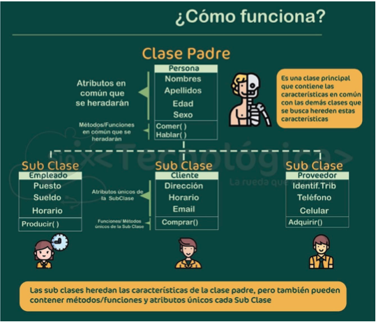
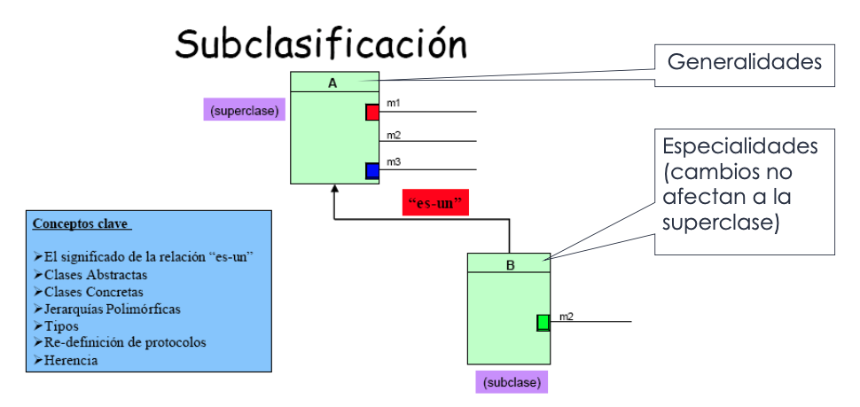
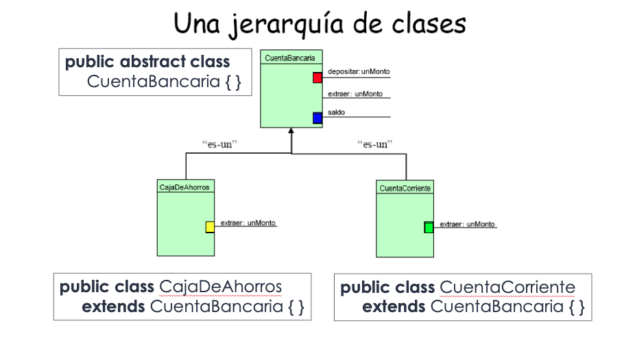
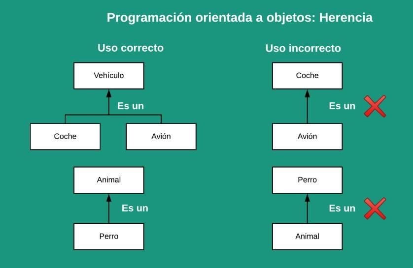

# Herencia

* Usamos las clases para representar parte del conocimiento que adquirimos del dominio de problema
* ¿Qué sucede cuando las clases comparten parte del conocimiento que representan? ==> Subclasificación
* Crear clases nuevas que se construyan tomando como base clases ya existentes
* Cuando se hereda, se reutilizan métodos y atributos
* Permite extender la funcionalidad de un objeto

| Tipos | | Ejemplo | LOO |
| -- | -- | -- | -- |
| **Simple**   | una clase puede heredar de una única clase | Circulo es una Figura              | **Java**, C# |
| **Múltiple** | una clase puede heredar de varias clases   | Alumno es una Persona y es un Hijo | **Python**, Eiffel, C++ |







## Uso correcto



=== "java"

  ```java
  public class CajaDeAhorro extends CuentaBancaria {

    // constructores NO se heredan de las superclases
    public CajaDeAhorro() {
      // se puede invocar del constructor de la subclase a la superclase con super()
      // debe ser primera sentencia del cuerpo del constructor
      super();
      ...
    }

  }
  ```

=== "python"

  ```py
  class CajaDeAhorro(CuentaBancaria):

    # constructores se heredan
    def __init__(self):
      # se puede invocar del constructor de la subclase a la superclase con super().__init__()
      super().__init__()
      ...
  ```

## Métodos

* Si heredo métodos que no tienen sentido en la subclase, la jerarquía fue forzada -> MAL DISEÑO
* Si heredo métodos que son insuficientes en la subclase -> OVERWRITING
* La sobreescritura puede ser PARCIAL o TOTAL
* Para sobrescribir un método se debe respetar la signatura del mismo

=== "java"

  ```java
  public String toString() {
    ...
  }

  public boolean equals(Object obj) {
    ...
  }
  ```

=== "python"

  ```py
  def __str__(self):
    pass

  def __eq__(self, otro_objeto):
    pass
  ```

## Herencia múltiple

=== "python"

  ```py
  class A:
    
    def m(self):
        return "soy m de la clase A"

  class B:
      
    def m(self):
        return "soy m de la clase B"

  # se dá preferencia a la 1ra clase que se indique en la declaración
  # ante el problema si varias superclases tienen los mismos attr/methods
  class C(A, B):
    pass

  c = C()
  print(isinstance(c, C))  # True
  print(isinstance(c, A))  # True
  print(c.m())             # "soy m de la clase A"
  ```
