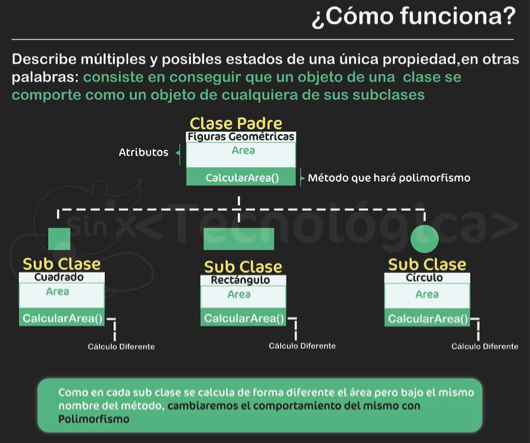
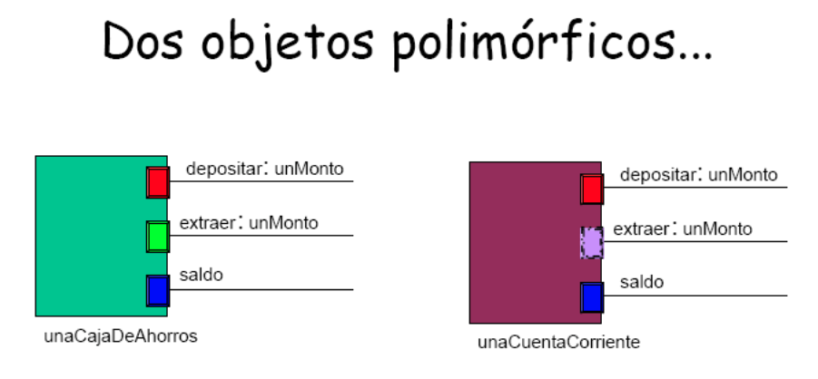
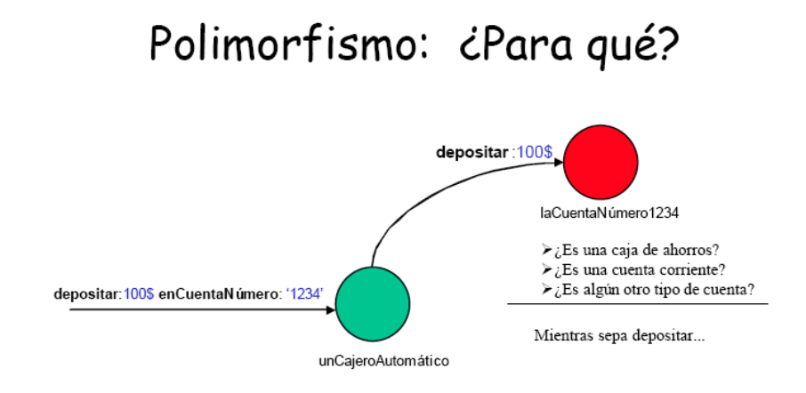
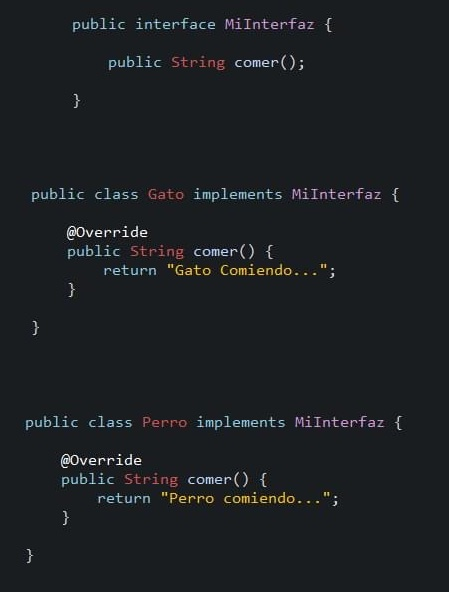

# Polimorfismo

* Es la capacidad que tienen los objetos de una clase de responder al mismo mensaje en función de los parámetros utilizados durante su invocación
* Ejemplo 1: todos los objetos responden a equals/\_\_eq\_\_, toString/\_\_str\_\_, etc.
* Ejemplo 2: un celular se puede apagar, una lampara se pude apagar, ..., todos los objetos apagables se pueden apagar



* Dos o más objetos son polimórficos respecto de un conjunto de mensajes, si todos pueden responder estos mensajes, aún cuando cada uno lo haga de un modo diferente
* Objetos polimórficos corresponden a un mismo “tipo” de objeto -> mismo comportamiento esencial, independientemente de implementación
* Permite que clases de distintos tipos puedan ser referenciadas por una misma variable:

=== "java"

```java
CuentaBancaria cuentaBancaria;
cuentaBancaria = new CajaDeAhorro();
cuentaBancaria = new CuentaCorriente();
```

=== "python"

```py
class A:
  def m(self):
    print('soy A')

class B:
  def m(self):
    print('soy B')

def hacer(x):
  # en tiempo de ejecución sabe a que método "m" 
  # invocar dependiendo del tipo de objeto
  x.m()       

hacer(A())
hacer(B())
```





* Es la clave de un buen diseño:
  * "Código" genérico.
  * Objetos desacoplados.
  * Objetos intercambiables.
  * Objetos reusables.
  * Programar por protocolo, no por implementación (buscar la esencia).

## Interfaces

* Es una forma de describir lo que deberían hacer las clases sin especificar cómo deben hacerlo (protocolo de comportamiento)
* Es una colección de declaraciones de constantes y definiciones de métodos sin implementación, agrupados bajo un nombre
* No debe crecer, si se cambia el comportamiento de una interface, todas las clases que la implementen fallarán

=== "java"

* La razón de usar interfaces es que Java tiene comprobación estricta de tipos. Cuando se hace una llamada a un método, el compilador necesita ser capaz de averiguar si el método existe realmente

  ```java
  package nombre_paquete;
  {importaciones}
  [public] interface NombreInterface [extends SuperInterfaces] {
    [Constantes, por default public static final]
    [Encabezados de métodos, por default public abstract]
  }
  ```

* Puede extender múltiples interfaces. Por lo tanto, se tiene herencia múltiple de interfaces.
* Super Interfaces es una lista de nombres de interfaces separados por coma.
* Una interfaz hereda todas las constantes y métodos de sus Super Interfaces.
* Ejemplo 1

  

* Ejemplo 2

  ```java
  public interface Reseteable {
    void reset();
  }
  ```

  ```java
  public class Punto implements Reseteable {
    public void reset() {
      ...
    }
  }
  ```

  | Propiedades | Ejemplo |
  | -- | -- |
  | Una clase que implementa una interface debe implementar cada uno de los métodos que están definidos en ésta ||
  | Una clase puede implementar una o más interfaces | public class A implements B, C { } |
  | Se pueden declarar variables de tipo interface | Reseteable reseteable; |
  | Las variables de tipo interface tienen que referirse a un objeto de tipo de una clase que implemente la interface | reseteable = new Punto(); |
  | Se puede usar instanceof para comprobar si un objeto implementa o no la interface | new Punto(5.0, 3.0) instanceof Reseteable; |

=== "python"

* **Interfaces informales**

  ```py
  # simple clase que no implementa los métodos
  class Mando:
      def ch_up(self):
          pass
      def ch_dw(self):
          pass

  # clase extiende a la clase Mando pero no esta obligada a implementar los métodos
  class MandoSamsung(Mando):
      def ch_up(self):
          return "Samsung-> +"
      def ch_dw(self):
          return "Samsung-> -"

  class MandoLG(Mando):
      def ch_up(self):
          return "LG -> +"
      def ch_dw(self):
          return "LG -> -"
  ```

* **Interfaces formales**

  ```py
  from abc import abstractmethod
  from abc import ABCMeta

  class Mando(metaclass=ABCMeta):
      @abstractmethod
      def ch_up(self):
          pass
      @abstractmethod
      def ch_dw(self):
          pass

  # clase extiende a la clase Mando y esta obligada a implementar los métodos
  class MandoSamsung(Mando):
      def ch_up(self):
          return "Samsung-> +"
      def ch_dw(self):
          return "Samsung-> -"

  mando = Mando() # TypeError: Can't instantiate abstract class Mando with abstract methods...
  ```

## Pincipios SOLID

* Conjunto de 5 principios que facilitan el testeo, mantenimiento y la legibilidad del código
* SOLID es el acrónimo mnemónico que hace referencia a cada uno de los principios por sus siglas en inglés:

  ||||
  | -- | -- | -- |
  | **S**ingle Responsibility Principle | SRP | Principio de Responsabilidad Única     |
  | **O**pen-Closed Principle           | OCP | Principio de Abierto/Cerrado           |
  | **L**iskov Substitution Principle   | LSP | Principio de Substitución de Liskov    |
  | **I**nterface Segregation Principle | ISP | Principio de Segregación de Interfaz   |
  | **D**ependency Inversion Principle  | DIP | Principio de Inversión de Dependencias |

* [Ejemplos en Python](https://blog.damavis.com/los-principios-solid-ilustrados-en-ejemplos-sencillos-de-python/)
