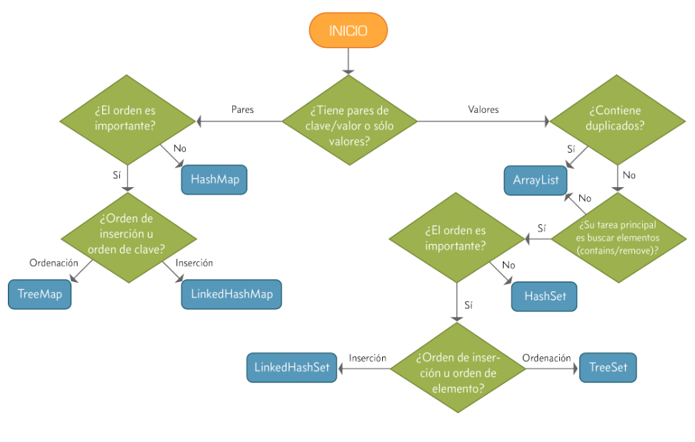
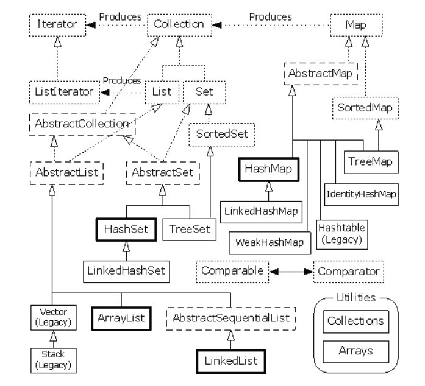

# Colecciones

## Concepto

* Representa un grupo de objetos (elementos)
* Es el almacén lógico donde guardar los elementos
* Son formas de organizar la información para manipular, buscar e insertar datos de manera eficiente

=== "java"

* En Java se emplea la interfaz genérica Collection.

  | Tipos (interfaces) | | Implementaciones |
  | -- | -- | -- |
  | **Set**  | colección que no puede contener elementos duplicados | HashSet, TreeSet, LinkedHashSet |
  | **List** | sucesión de elementos. Admite duplicados | ArrayList, LinkedList |
  | **Map**  | asocia claves a valores. No puede contener claves duplicadas y cada clave sólo puede tener asociado un valor | HashMap, TreeMap, LinkedHashMap |

  

  

  ```java
  // array redimensionable que aumenta su tamaño según crece la colección de elementos
  ArrayList<Integer> vector = new ArrayList<Integer>();
  vector.add(2);     // agrega 2 al final
  vector.add(1, 5);  // agrega 5 en la posición 1
  vector.set(0, 3);  // sustituye elemento que se encuentra en posición 0 por el objeto 3
  vector.get(1);     // devuelve elemento en la posición 1
  vector.remove(2);  // elimina elemento en la posición 2
  vector.toString(); // aplana a un string
  vector.isEmpty();  // verifica si esta vacio
  vector.indexOf(5); // devuelve posición del elemento 5, si no existe devuelve -1
  vector.size();     // devuelve tamaño del vector
  vector.contains(5);// verifica si está el elemento 5
  vector.clear();    // elimina todos los elementos

  // for
  for(int i = 0;  i < vector.size();  i++)
    vector.get(i);

  // for each
  for(Object objeto: vector)
    objeto

  // Iterator
  Iterator it = vector.iterator(); // se crea el iterador it para el array
  while(it.hasNext())              // mientras queden elementos
    it.next();                     // se obtienen

  for (Iterator it = vector.iterator(); it.hasNext();)
    it.next();

  // ----------------------------------------------------------------------

  // lista doblemente enlazada de los elementos
  List<Integer> lista = new LinkedList<Integer>();
  lista.add(2);
  lista.add(1, 5);
  lista.add(3);
  lista.remove(1);
  lista.toString();
  lista.isEmpty();
  lista.get(1);
  lista.size();

  // ----------------------------------------------------------------------

  // LIFO (Last In First Out)
  Stack<Integer> pila = new Stack<Integer>();
  pila.push(2);
  pila.push(5);
  pila.push(3);
  pila.pop();
  pila.empty();
  pila.peek();     // elemento en el tope

  // ----------------------------------------------------------------------

  // FIFO (First In First Out)
  ArrayDequ<Integer> cola = new ArrayDeque<Integer>();
  cola.offer(2);
  cola.offer(5);
  cola.offer(3);
  cola.poll();
  cola.isEmpty();
  cola.peek();     // primer elemento de la cola

  // ----------------------------------------------------------------------

  // almacena claves en una tabla hash
  HashMap<String, Object> map = new HashMap<String, Object>();
  map.put("user", "ppando");
  map.get("user");

  // ----------------------------------------------------------------------

  // útil para almacenar y recuperar archivos de propiedades
  Properties prop = new Properties();
  prop.put("user", "ppando");
  prop.get("user");
  prop.load(new FileInputStream(new File("/prop.properties")));
  ```

=== "python"

```py
# puede guardar distintos tipos de valores
# se pueden expandir dinámicamente, agregando nuevos elementos
lista_vacia = []
lista = ['Maria', 'Pepe', 'Marta', 'Antonio']
lista_lista = [1, [2, 3], 4]

# list(c): crea una lista con los elementos de la secuencia o colección c.
print(list())
print(list((1, 2, 3)))
print(list('python'))

lista[:]   # Toda la lista
lista[2]   # Marta
lista[7]   # IndexError: list index out of range
lista[-2]  # Marta
lista[0:3] # ['Maria', 'Pepe', 'Marta']
lista[1:]  # ['Pepe', 'Marta', 'Antonio']
lista[:2]  # ['Maria', 'Pepe']

# operaciones que no modifican la lista
len(lista) # 4
min(lista)
max(lista)
sum(lista)
lista.index('Antonio')  # 3
lista.count('Antonio')  # 1
'Pepe' in lista         # True
'Juan' in lista         # False

# Operaciones que modifican la lista
lista.append('Ana')             # agrega al final
lista.insert(2, 'Ana')          # agrega en índice 2
lista.extend(['Luis', 'Pablo']) # une listas al final
lista.remove('Ana')
lista.pop()                     # elimina último elemento
lista.sort()
lista.reverse()

# Listas por comprensión
lista = [1, 2, 3, 4, 5, 6]
[x*2 for x in lista if x > 2]

# -----------------------------------------------------------------------

# listas inmutables
# ventajas: + rápidas en cuanto a ejecución y - espacio (mayor optimización)
tupla_vacia = ()
tupla = ('Juan', 13, 1, 1995)
tupla_tupla = ((1, 2, 3), (4, 5, 6))

# tuple(c): crea una tupla con los elementos de la secuencia o colección c.
print(tuple())
print(tuple([1, 2, 3]))
print(tuple('python'))

tupla[1]             # 13
len(tupla)           # 4
tupla.count(9)       # 1
tupla.index('Juan')  # 0
'Juan' in tupla      # True

list(tupla)          # Convierte tupla en lista
tuple([1, 2])        # Convierte lista en tupla

nom, dd, mm, yyyy = tupla # desempaquetado de tupla
print(nom)                # 'Juan'

# -----------------------------------------------------------------------

# asociación de tipo clave : valor
# los elementos almacenados no están ordenados.
dicc_vacio = {}
dicc = {'Arg':'Bs As', 'Chile':'Santiago', 'Brasil':'Brasilia'}
dicc_dicc = {'nom_full': {'nom': 'pp', 'ape': 'perez'}, 'edad': 45}

# Acceso a valores
dicc['Brasil']          # 'Brasilia'
dicc.get('Brasil')      # 'Brasilia'

# Operaciones que no modifican a un diccionario
len(dicc)     # 3
min(dicc)
max(dicc)
sum(dicc)

'España' in dicc  # False
dicc.keys()       # ['Arg', 'Chile', 'Brasil']
dicc.values()     # ['Bs As', 'Santiago', 'Brasilia']
dicc.items()

# Operaciones que modifican a un diccionario
dicc['Arg'] = 'Buenos Aires'            # agregar elemento
dicc.update({'Uruguay': 'Montevideo'})  # actualiza
dicc.pop('Uruguay')                     # elimina elemento
dicc.clear()
```
