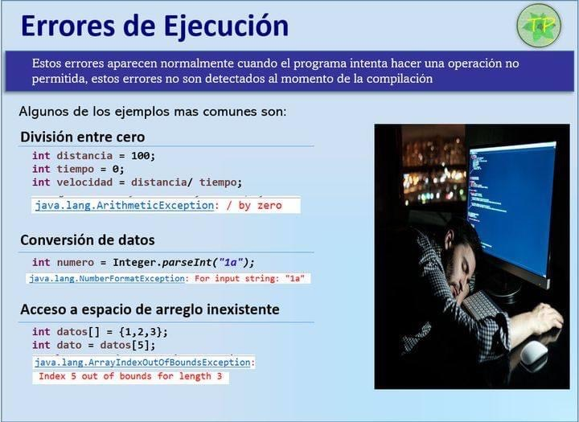

# Excepciones

* Representan condiciones excepcionales que el programador quiere tratar (controlar)
* Aparecen cuando el programa intenta hacer una operación no permitida
* Errores no detectados al momento de la compilación, si en tiempo de ejecución
* Usuarios esperan que el programa se comporte de forma sensata cuando se producen errores -> volver a un estado seguro

| Tipo | Clase Java | Clase Python |
| -- | -- | -- |
| División entre cero                     | **ArithmeticException**            | **ZeroDivisionError** |
| Conversión de datos                     | **NumberFormatException**          | **TypeError**         |
| Archivo incorrecto                      | **IOException**                    | **FileNotFoundError** |
| Acceso a espacio de arreglo inexistente | **ArrayIndexOutOfBoundsException** | **IndexError**        |
| null.método()                           | **NullPointerException**           | **ValueError**        |
| Refundiciones incorrectas               | **ClassCastException**             |                       |
| Acceso a dict con key inexistente       |                                    | **KeyError**          |
| Falla importación módulo                |                                    | **ImportError**       |

## Clasificación de Excepciones

=== "java"

  

  | Clase | | ¿Recuperable? |
  | -- | -- | -- |
  | **Exception** | se produce porque se ha cometido un error de programación | SI |
  | **Error**     | describe errores internos y el agotamiento de recursos    | NO |

  | Tipos de exceptions | | Ejemplos |
  | -- | -- | -- |
  | **Comprobadas**    | compilador verifica que el programador proporcione, o bien, un manejador o que lance la excepción | IOException, FileNotFoundException, SQLException, ... |
  | **No Comprobadas** | excepciones comunes que no se comprueban | Error y sus subclases (OutOfMemoryError, InternalError, ...) y RuntimeException y sus subclases (NullPointerException, ArrayIndexOutOfBoundException, NumberFormatException, ClassCastException, ArithmeticException, ...) |

  

## Declaración

* Para crear excepciones propias generalmente se hace una subclase de Exception

=== "java"

  ```java
  public class NombreException extends Exception { }
  ```

=== "python"

  ```py
  class NombreException(Exception):
    pass
  ```

## ¿Cómo se causan excepciones?

* Implícitamente: el programa hace algo ilegal
* Explícitamente: ejecución de la sentencia throw

=== "java"

  ```java
  public class SinNaftaException extends Exception { }

  public class Auto {
    
    public void arrancar() {
      if (nafta < 0.1)
        throw new SinNaftaException();
      ...
    }

  }  
  ```

=== "python"

  ```py
  class SinNaftaException(Exception):
    pass

  class Auto:

    def arrancar(self):
      if self.nafta < 0.1:
        raise SinNaftaException()
  ```

## ¿Cómo manejar una excepción?

=== "java"

```java
public double divide(double op1, dpuble op2) {
  try {
    // código que levanta la excepción
    return op1 / op2;
  } catch (ArithmeticException ex) {
    // código que se ejecuta en caso de excepción
    System.out.println("No se puede dividir por cero");
    return 0;
  }
}
```

=== "python"

  ```py
  def divide(n1, n2):
    try:
      return n1 / n2
    except ZeroDivisionError:
      print('No se puede dividir por cero')
      return 'operación errónea'
  ```

## ¿Cómo manejar múltiples excepciones?

=== "java"

  ```java
  public void divide() {
    try {
      Scanner in = new Scanner(System.in);
      double op1 = in.nextDouble();
      double op2 = in.nextDouble();
      in.close();
      System.out.println("La división es " + op1 / op2);
    } catch (NumberFormatException ex1) {
      System.out.println("Valores incorrectos");
    } catch (ArithmeticException ex) {
      System.out.println("No se puede dividir por cero");
    }
    System.out.println("Cálculo finalizado");
  }
  // en aumento a Exception (de lo particular a lo general); al revés no compila
  ```

=== "python"

  ```py
  def divide():
    try:
      op1 = int(input('Num 1: '))
      op2 = int(input('Num 2: '))
      print('La división es ' + str(op1 / op2))
    except ValueError:
      print('Valores incorrectos')
    except ZeroDivisionError:
      print('No se puede dividir entre cero')
    print('Cálculo finalizado')
  ```

## Comportamiento de tipo reanudación

=== "java"

  ```java
  double op1 = 0;
  double op2 = 0;
  while (true) {
    try {
      Scanner in = new Scanner(System.in);
      System.out.print("Num 1: ");
      op1 = in.nextDouble();
      System.out.print("Num 2: ");
      op2 = in.nextDouble();
      in.close();
      break;
    } catch (NumberFormatException e) {
      System.out.println("Valores incorrectos. Intente nuevamente");
    }
    System.out.println(divide(op1, op2));
  }
  ```

=== "python"

  ```py
  while True:
    try:
      n1 = int(input('Num 1: '))
      n2 = int(input('Num 2: '))
      break
    except ValueError:
      print('Valores incorrectos. Intente nuevamente')
  print(divide(n1, n2))    
  ```

## Sobre el uso de excepciones

* Una condición de error es tratada sólo donde tiene sentido hacerlo y no en todo el nivel entre que ocurre y es tratada
* El código puede ser escrito como si todas las operaciones funcionaran correctamente
* Deben ser tratadas lo más específicamente posible
* No se deben dejar vacíos o solo imprimiendo el stack trace los bloques catch
* Stack Trace (Seguimiento de Pila): listado de todas las llamadas a métodos pendientes en un determinado momento de la ejecución de un programa
