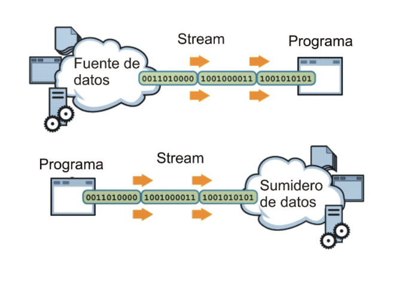

# Archivos

## Funciones

* Administración del Sistema de Archivos (clase File)
* Persistencia de datos (Buffering): guardar información más allá del tiempo de ejecución de un programa.

## Administración del Sistema de Archivos

* **File**: proporciona información acerca de los archivos, de sus atributos, de los directorios, etc.
* La clase File tiene 3 constructores:
  * File(String path)
  * File(String path, String name)
  * File(File dir, String name)
    * path: indica el camino hacia el directorio donde se encuentra el archivo.
    * name: indica el nombre del archivo.

| Métodos de File |
| -- |
| getName():String |
| getPath():String |
| getParent():String |
| exists():boolean |
| canWrite():boolean |
| canRead():boolean |
| isFile():boolean |
| isDirectory():boolean |
| isHidden():boolean |
| toURL():URL |
| length():long |
| lastModified():long |
| mkdir():boolean |
| delete():boolean |
| renameTo(File):boolean |
| createNewFile():boolean |
| list():String[] |
| listFiles():File[] |
| list(FilenameFilter):String[] |
| listFiles(FilenameFilter):File[] |

## Persistencia de datos

* Flujo de ENTRADA (**BufferedReader**): abstracción que consume información
* Flujo de SALIDA (**BufferedWriter**): abstracción que produce información
* Operaciones de Flujo:
    1. Apertura del Flujo
    1. Lectura/Escritura en el flujo
    1. Cierre del Flujo



## Persistencia de datos como objetos (objetos serializados)

```java
// Lectura de Objetos
ObjectInputStream ois = new ObjectInputStream(new FileInputStream(new File("tst.dat")));
Punto p = (Punto) ois.readObject();

// Escritura de Objetos
ObjectOutputStream oos = new ObjectOutputStream(new FileOutputStream(new File("tst.dat")));
oos.writeObject(new Punto(1, 2));
```

## Persistencia de datos como texto

```java
// Lectura de Texto
BufferedReader br = new BufferedReader(new FileReader("prueba.txt"));
while((linea = br.readLine()) != null)
  System.out.println(linea);

// Escritura de Texto
BufferedWriter bw = new BufferedWriter(new FileWriter("prueba.txt"));
bw.write("hola");
bw.newLine();
```

## Ejercicios

1. Crear un archivo de texto con el nombre y contenido que quiera. Crear una aplicación que lea el archivo de texto y muestre su contenido por pantalla sin espacios. Por ejemplo, si el archivo tiene el siguiente texto “Esto es una prueba”, deberá mostrar “Estoesunaprueba”. Capturar las excepciones que sean necesarias.
1. Crear una aplicación donde se solicite la ruta de un archivo por teclado y un texto que se desea escribir en el archivo. Se deberá mostrar por pantalla el mismo texto pero variando entre mayúsculas y minúsculas, es decir, si se escribe “Bienvenido” deberá devolver “bIENVENIDO”. Si se escribe cualquier otro carácter, se quedará tal y como se escribió. Se deberá crear un método para escribir en el archivo el texto introducido y otro para mostrar el contenido en mayúsculas.
1. Crear una aplicación que solicite la ruta de dos archivos de texto y de una ruta de destino (solo la ruta, sin archivo al final). Se deberá copiar el contenido de los dos archivos en uno, este tendrá el nombre de los dos archivos separados por un guión bajo, y se guardará en la ruta donde se le haya indicado por teclado. Para unir los archivos en uno, crear un método donde se le pase como parámetro todas las rutas. En este método, además de copiar debe comprobar que sí existe el archivo de destino, muestre un mensaje informando de si se quiere sobrescribir el archivo. Por ejemplo, si se tiene un archivo A.txt con “ABC” como contenido, un archivo B.txt con “DEF” y una ruta de destino D:\, el resultado será un archivo llamado A_B.txt en la ruta D:\ con el contenido “ABCDEF”.
