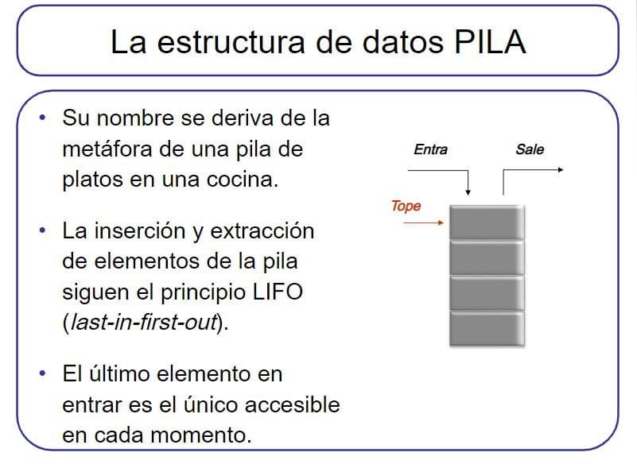
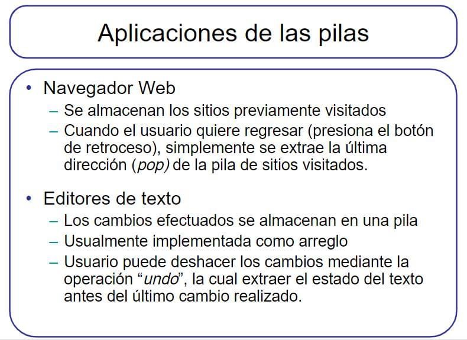
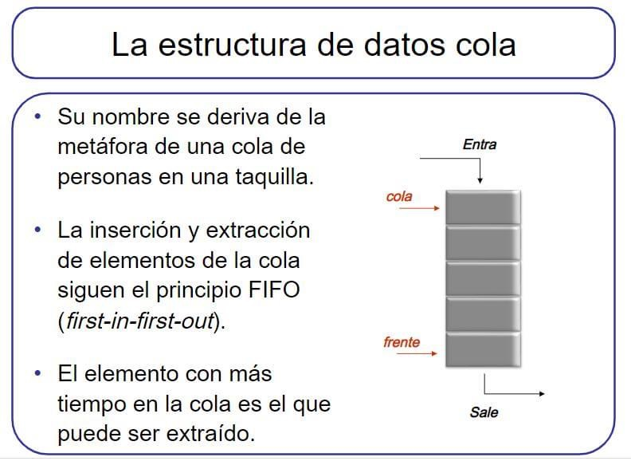
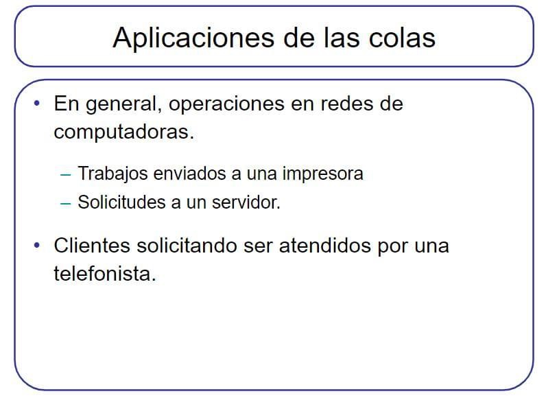
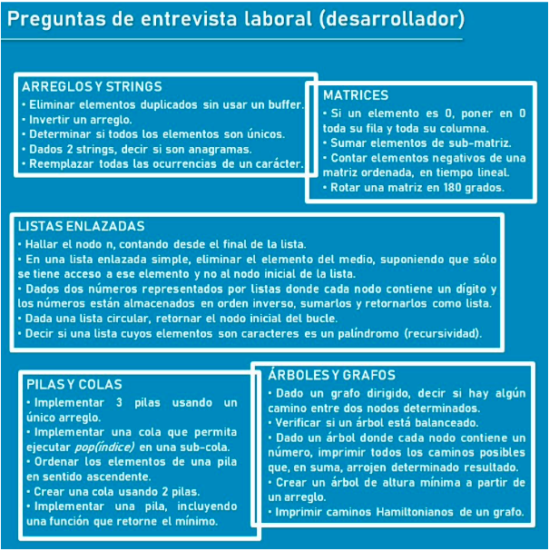

# Colecciones

## Concepto

* Representa un grupo de objetos (elementos).
* Es el almacén lógico donde guardar los elementos.
* Son formas de organizar la información para manipular, buscar e insertar datos de manera eficiente.
* En Java se emplea la interfaz genérica Collection.
* Tipos (interfaces):
  * Set (HashSet, TreeSet, LinkedHashSet).
  * List (ArrayList, LinkedList).
  * Map (HashMap, TreeMap, LinkedHashMap).

## Diagrama de decisión para uso de Colecciones Java


## Jerarquía


## Set

* Define una colección que no puede contener elementos duplicados.
* Implementaciones:
  * **HashSet**: almacena los elementos en una tabla hash.  No importa el orden que ocupen los elementos.
  * **TreeSet**: almacena los elementos ordenándolos en función de sus valores. Los elementos almacenados deben implementar la interfaz Comparable.
  * **LinkedHashSet**: almacena los elementos en función del orden de inserción.

## List

* Define una sucesión de elementos. Admite duplicados.
* Implementaciones:
  * **ArrayList**: se basa en un array redimensionable que aumenta su tamaño según crece la colección de elementos. Es la que mejor rendimiento tiene sobre la mayoría de situaciones.
  * **LinkedList**: se basa en una lista doblemente enlazada de los elementos, teniendo cada uno de los elementos un puntero al anterior y al siguiente elemento.
  * **Stack**: LIFO (Last In First Out).

### ArrayList

* Almacenan múltiples datos en una sola variable.

```java
ArrayList<Integer> vector = new ArrayList<Integer>();
System.out.println("Esta vacio?: " + vector.isEmpty());
vector.add(2);
vector.add(5);
vector.add(3);
System.out.println("toString: " + vector);
vector.remove(2);
System.out.println("toString: " + vector);
System.out.println("Esta vacio?: " + vector.isEmpty());
System.out.println("Posición del elemento 5: " + vector.indexOf(5));
System.out.println("Tamaño del vector: " + vector.size());
```

| Método | Descripción |
| -- | -- |
| size() | Devuelve el número de elementos (int) |
| add(x) | Agrega el objeto x al final. Devuelve true |
| add(posicion, x) | Inserta el objeto x en la posición indicada |
| get(posicion) | Devuelve el elemento que está en la posición indicada |
| remove(posicion) | Elimina el elemento que se encuentra en la posición indicada. Devuelve el elemento eliminado |
| remove(x) | Elimina la primera ocurrencia del objeto x. Devuelve true si el elemento está en la lista |
| clear() | Elimina todos los elementos |
| set(posicion, x) | Sustituye el elemento que se encuentra en la posición indicada por el objeto x. Devuelve el elemento sustituido |
| contains(x) | Comprueba si la colección contiene al objeto x. Devuelve true o false |
| indexOf(x) | Devuelve la posición del objeto x. Si no existe devuelve -1 |

* Recorridos de ArrayList

```java
// for
for(int i = 0;  i < nombreArray.size();  i++)
  System.out.println(nombreArray.get(i));

// for each
for(Object objeto: nombreArray)
  System.out.println(objeto);

// Iterator
Iterator it = nombreArray.iterator();      // se crea el iterador it para el array
while(it.hasNext())                        // mientras queden elementos
  System.out.println(it.next());           // se obtienen y se muestran

for (Iterator it = nombreArray.iterator(); it.hasNext();)
  System.out.println(it.next());

```

### LinkedList

* Se componen de nodos que tienen dos atributos (dato y enlace).
* []->[]->[]->null

```java
List<Integer> lista = new LinkedList<Integer>();
System.out.println("Esta vacia?: " + lista.isEmpty());
lista.add(2);
lista.add(1, 5);
lista.add(3);
System.out.println("toString: " + lista);
lista.remove(1);
System.out.println("toString: " + lista);
System.out.println("Esta vacia?: " + lista.isEmpty());
System.out.println("Elemento en pos 1?: " + lista.get(1));
System.out.println("Tamaño de la lista: " + lista.size());
```

### Stack





```java
Stack<Integer> pila = new Stack<Integer>();
System.out.println("Esta vacia?: " + pila.empty());
pila.push(2);
pila.push(5);
pila.push(3);
System.out.println("toString: " + pila);
pila.pop();
System.out.println("toString: " + pila);
System.out.println("Esta vacio?: " + pila.empty());
System.out.println("Elemento en el tope: " + pila.peek());
```

## Cola






## Map

* Asocia claves a valores. No puede contener claves duplicadas y; cada clave, sólo puede tener asociado un valor.
* Implementaciones:
  * **HashMap**: almacena las claves en una tabla hash. Es la implementación con mejor rendimiento de todas pero no garantiza ningún orden a la hora de realizar iteraciones.
  * **TreeMap**: almacena las claves ordenándolas en función de sus valores. Las claves almacenadas deben implementar la interfaz Comparable.
  * **LinkedHashMap**: almacena las claves en función del orden de inserción.
  * **Properties**: útil para almacenar y recuperar archivos de propiedades (opciones de configuración para programas).

### Properties

```java
Properties prop = new Properties();
prop.put(“user”, “ppando”);
prop.get(“user”);
prop.load(new FileInputStream(new File(“/prop.properties")));
```

### HashMap

```java
HashMap<String, Object> map = new HashMap<String, Object>();
map.put("user", "ppando");
map.get("user");
```

## Ejercicios

1. En una terminal de teletipo existe un carácter de retroceso que permite cancelar el último carácter. Por ejemplo: si el carácter de retroceso es /, entonces la línea abc/d//e será interpretada como ae. Existe también un carácter anulador que elimina todos los caracteres ingresados hasta el momento, suponga que ese carácter es &. Realice un método que dada una tira de caracteres terminadas con * (leída del archivo “Fuente.txt”) ejecute las operaciones indicadas si se encuentra con el carácter / o el &. Debe por último imprimir la tira resultante.

1. En un supermercado se mantiene una cola A con diversos clientes de los que se conoce número de ubicación en la cola y cantidad de productos que lleva. Se abre una nueva cola B para clientes que llevan menos de 5 productos. Usted debe dejar en la cola A los clientes que llevan más de 5 o hasta 5 productos en el orden en que estaban, y en la cola B los que compran menos de 5 artículos, respetando el orden que tenían en la cola A. En ambas colas reasignar un nuevo número de ubicación.

1. Se tiene ordenada por código de producto, una lista donde cada Producto, tiene como atributos código,  descripción, importe y  stock. Implementar métodos para:
    1. Imprimir la lista completa.
    1. Dado un entero k, imprimir el k-ésimo elemento.
    1. Incrementar el importe de un producto dado en un 10%.
    1. Devolver el stock de un producto dado o cero si no esta.
    1. Devolver una lista de productos con stock inferior a 50 unidades.
    1. Devolver una lista de productos con stock superior o igual a 50 unidades.

1. Diseñe e implemente un juego de memoria donde la idea es para un nivel inicial encontrar los pares de coincidencias.
    * La solución debe contemplar varios niveles de dificultad, para ello debe disponer de una colección de tableros, modelizados a través de una jerarquía.
    * La clase abstracta Tablero debe incluir métodos para inicializar el tablero y para indicar las selecciones sucesivas del usuario.
    * Para la entrega del ejercicio, debe implementar un tablero de 6x6 celdas que contengan números dispuestos aleatoriamente.
    * Cuando el usuario escoge una celda se visualiza el número que contiene la misma, si la segunda selección resulta en coincidencia entonces ambas celdas desaparecen, sino ambas ocultan nuevamente el número que contienen.
    * Durante el juego además del tablero se debe mostrar la cantidad de selecciones que realiza el usuario.

1. Se ingresa por teclado un conjunto de valores enteros, El ingreso de datos finalizará cuando ingrese el valor 0 (cero). Luego se ingresa otro conjunto de valores enteros y, por cada uno de estos, se debe informar si el valor ingresado pertenece o no al primer conjunto.

1. Utilizando la función eliminar, se pide ingresar dos conjuntos A y B para mostrar el contenido resultante C = A – B.

1. Se ingresa por teclado un conjunto de valores que finaliza con la llegada de un 0 (cero). Se pide mostrar los elementos del conjunto en orden inverso al original. Usar pila.

1. Se debe procesar un archivo que contiene información sobre los siniestros denunciados por los clientes de una compañía de seguros En el archivo existe un registro por cada denuncia, con los siguientes campos:
    * Número de matrícula (6 caracteres).
    * Fecha (10 caracteres, con formato “dd/mm/aaaa”).
    * Detalles (256 caracteres).
    * No se conoce cuántas matrículas diferentes existen ni tampoco la cantidad máxima de siniestros denunciados que puede haber por cada una de ellas. Los registros en el archivo están ordenados ascendentemente por fecha.
    * Se pide emitir un listado ordenado por número de matrícula informando, por cada una, la fecha y el detalle de cada uno de los siniestros denunciados.

1. Para analizar el rendimiento de sus empleados, una empresa decide llevar el registro de las actividades que cada uno desarrolla durante su tiempo de trabajo. En la empresa trabajan hasta 50 empleados (numerados de 0 a 49) y existen hasta 200 proyectos (numerados de 0 a 199). Al finalizar la jornada laboral, cada empleado completa uno o varios registros en el archivo HORAS.dat cuya estructura es la siguiente:
    * Número de empleado.
    * Número de proyecto.
    * Cantidad de horas.
    * Descripción de la tarea realizada.
    * Fecha de la tarea.
    * El archivo se encuentra ordenado naturalmente, es decir, por fecha ascendente. Se pide generar un listado que informe por cada empleado el detalle de las tareas realizadas en cada uno de los proyectos en los que participó. El listado debe estar ordenado por número de empleado, luego por número de proyecto y, finalmente, por fecha descendente, es decir, primero las tareas más recientes.

1. Supongamos que nos piden desarrollar un sistema para administrar la entrega de platos y bebidas en las diferentes mesas de un restaurante. Cada mesa se identifica con un número entero (el número de mesa) y cada plato o bebida se identifica con un código numérico entero (el código del plato o bebida). Durante su permanencia los comensales solicitan al mozo que les sirva diferentes cantidades de platos y bebidas. Luego, al finalizar el almuerzo o la cena, le solicitarán la cuenta, que consiste en un detalle de lo que han consumido y el importe total que deben pagar.

1. Una biblioteca desea sistematizar sus sistema de préstamos a sus asociados. Tener en cuenta que la biblioteca maneja libros, revistas nacionales, revistas importadas y periódicos. Los préstamos se efectúan únicamente a socios que tengan su cuota actualizada y que no estén suspendidos. El lapso de préstamo es de 15 días. Ningún socio puede tener más de tres libros en su poder al mismo tiempo. Las demoras en la devolución de libros se castigan con un lapso de suspensión igual al lapso de la demora. Si un libro pedido no está disponible el socio puede quedar en una cola de reservas. Un libro reservado sólo puede prestarse al primer socio en su cola de reservas. La biblioteca espera obtener información estadística de las preferencias de sus asociados. Diseñe el conjunto de clases necesarias para modelar el sistema.


