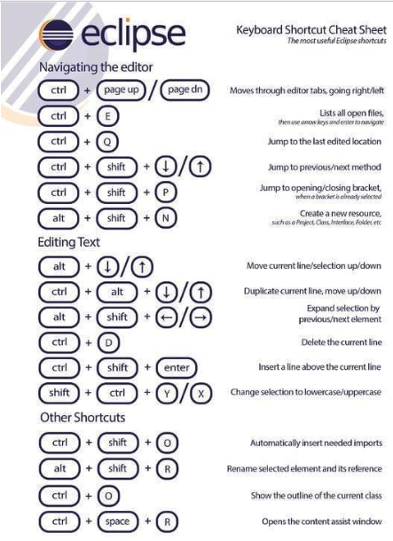

# Introducción al Lenguaje Java

## Razones para aprender Java

1. Usado por diferentes empresas y gobiernos. Ej. Facebook, Amazon, Gobiernos de Países.
1. Funciona en casi todo tipos de dispositivos. Ej. Smartphones, SmartTV, Web, Desktop
1. Cuenta con una gran comunidad de más de 20 años.
1. Altamente demandado en el mercado tecnológico.

## Aspectos de Java

* **Plataforma**: es un ambiente de software y/o hardware sobre el que se ejecuta un programa.
  * Enorme biblioteca.
  * Código reutilizable.
  * Entorno de ejecución: seguridad, adaptabilidad, Garbage Collector.


* **Lenguaje**: posibilita el desarrollo de aplicaciones seguras, robustas sobre múltiples plataformas en redes heterogéneas y distribuidas.
  * Sintaxis agradable.
  * Semántica comprensible.

## Características de Java

### Simple y Familiar

* El objetivo de los diseñadores de Java fue crear un lenguaje de programación que fuera fácil de aprender. Java adoptó una sintaxis similar a la de C/C++ teniendo en cuenta su popularidad. Y eliminó aquellas características que son fuente de confusión.
* Características de C/C++ eliminadas en Java: Preprocesador,  estructuras de datos,  uniones, herencia múltiple de clases,  GOTO,  punteros.

### Orientado a Objetos

* Java posee todas las características de un lenguaje orientado a objetos: Polimorfismo, Encapsulamiento y Herencia.
* Java implementa herencia simple de clases. Una clase puede ser subclase de una única clase. Todas las clases heredan de la clase Object. (Todo es un objeto)
* Java enriquece el modelo de herencia simple de clases, implementando interfaces.

### Distribuido

* Con Java es posible usar protocolos como HTTP y FTP para leer o copiar archivos remotos de manera tan simple como si estuviesen en el File System local.
* El comportamiento distribuido de Java posibilita la colaboración y la distribución de carga de trabajo del sistema.

### Seguro

* En Java el modelo de alocación de memoria es transparente al programador, ya que es controlado íntegramente por JVM.
* El intérprete Java chequea los archivos “.class“ que vienen de la red, evaluando que el código no falsifique punteros,  no viole restricciones de acceso, no viole el acceso a los objetos usando casting.

### Arquitectura neutral

* Java fue diseñado para soportar aplicaciones que se ejecutan en ambientes de redes heterogéneos, independientemente de la plataforma de hardware y del sistema operativo.

* La arquitectura neutral dada por los ByteCodes es el paso más importante hacia la portabilidad de los programas.

### Multithreaded

* Un Thread es un flujo de control secuencial dentro de un programa. Java provee múltiples threads en un programa, ejecutándose concurrentemente y llevando a cabo tareas distintas.
* La API Java contiene primitivas de sincronización.
* Los múltiples hilos (threads) de ejecución permiten mejorar la interactividad y la performance del sistema. (Mejor respuesta interactiva y comportamiento de tiempo real)

### Interpretado y dinámico

* El compilador Java genera ByteCodes para la JVM. El intérprete, incorporado en la JVM es el que permite ejecutar el programa.
* Los ByteCodes de Java pueden ejecutarse en cualquier plataforma que tenga la JVM implementada.
* Java es dinámicamente extensible ya que las clases se linkean a medida que se necesitan y pueden ser cargadas dinámicamente a través de la red.

## IDE

* Es una aplicación que provee un entorno de desarrollo de software con diversas herramientas integradas:
  * editor de código con resaltador de sintaxis.
  * compilador.
  * depurador.
  * terminal.
  * control de versiones.
  * etc.

* IDEs:
  * Eclipse
  * IntelliJ
  * NetBeans
  * BlueJ
  * Visual Studio

## Eclipse

* Es un IDE abierto y extensible (plugins)
* En 2001 IBM y Borland crearon la Fundación Eclipse
* [Sitio web](www.eclipse.org)



## Hola Mundo

* Edición:

  ```java
  public class HolaMundo {
    public static void main(String[] args){
      System.out.println("Hola Mundo");
    }
  }
  ```

* Compilación:

  ```sh
  $javac HolaMundo.java
  ```

* Ejecución:

  ```sh
  $java HolaMundo
  ```

## Ejercicios

1. FizzBuzz: Imprimir por pantalla los números del 1 al 100 pero considerando lo siguiente: a) Si el número es divisible por 3 se debe imprimir “Fizz”. b) Si el número es divisible por 5 se debe imprimir “Buzz”. c) Si el número es divisible por 3 y por 5 se debe imprimir “FizzBuzz”.

2. Sumados: Sumar los 1000 primeros números naturales (1 + 2 + 3 + 4 + … + 1000), imprimiendo por cada suma el resultado parcial obtenido.
