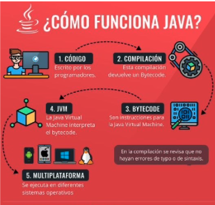
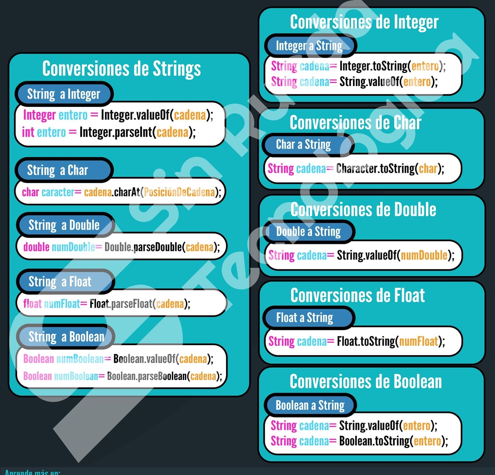
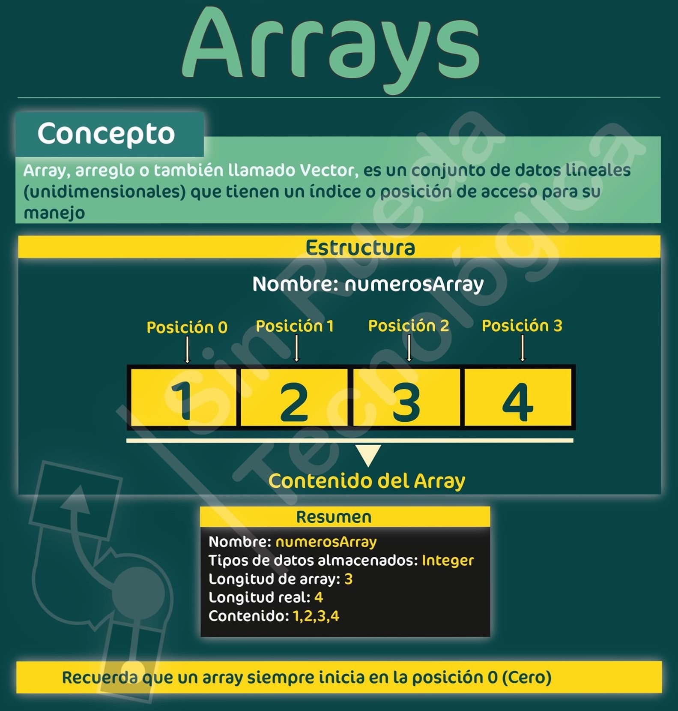

# Introducción a los Lenguajes Orientados a Objetos

## Razones para aprender Java

1. Usado por diferentes empresas y gobiernos. Ej. Facebook, Amazon, Gobiernos de Países.
1. Funciona en casi todo tipos de dispositivos. Ej. Smartphones, SmartTV, Web, Desktop
1. Cuenta con una gran comunidad de más de 20 años.
1. Altamente demandado en el mercado tecnológico.

## Usos

1. Desarrollo Android
1. Aplicaciones en escritorio
1. API web
1. Servidores web
1. Videojuegos

## Aspectos de Java

* **Plataforma**: es un ambiente de software y/o hardware sobre el que se ejecuta un programa.
  * Enorme biblioteca.
  * Código reutilizable.
  * Entorno de ejecución: seguridad, adaptabilidad, Garbage Collector.




* **Lenguaje**: posibilita el desarrollo de aplicaciones seguras, robustas sobre múltiples plataformas en redes heterogéneas y distribuidas.
  * Sintaxis agradable.
  * Semántica comprensible.

## Características de Java

### Simple y Familiar

* El objetivo de los diseñadores de Java fue crear un lenguaje de programación que fuera fácil de aprender. Java adoptó una sintaxis similar a la de C/C++ teniendo en cuenta su popularidad. Y eliminó aquellas características que son fuente de confusión.
* Características de C/C++ eliminadas en Java: Preprocesador,  estructuras de datos,  uniones, herencia múltiple de clases,  GOTO,  punteros.

### Orientado a Objetos

* Java posee todas las características de un lenguaje orientado a objetos: Polimorfismo, Encapsulamiento y Herencia.
* Java implementa herencia simple de clases. Una clase puede ser subclase de una única clase. Todas las clases heredan de la clase Object. (Todo es un objeto)
* Java enriquece el modelo de herencia simple de clases, implementando interfaces.

### Distribuido

* Con Java es posible usar protocolos como HTTP y FTP para leer o copiar archivos remotos de manera tan simple como si estuviesen en el File System local.
* El comportamiento distribuido de Java posibilita la colaboración y la distribución de carga de trabajo del sistema.

### Seguro

* En Java el modelo de alocación de memoria es transparente al programador, ya que es controlado íntegramente por JVM.
* El intérprete Java chequea los archivos “.class“ que vienen de la red, evaluando que el código no falsifique punteros,  no viole restricciones de acceso, no viole el acceso a los objetos usando casting.

### Arquitectura neutral

* Java fue diseñado para soportar aplicaciones que se ejecutan en ambientes de redes heterogéneos, independientemente de la plataforma de hardware y del sistema operativo.

* La arquitectura neutral dada por los ByteCodes es el paso más importante hacia la portabilidad de los programas.

### Multithreaded

* Un Thread es un flujo de control secuencial dentro de un programa. Java provee múltiples threads en un programa, ejecutándose concurrentemente y llevando a cabo tareas distintas.
* La API Java contiene primitivas de sincronización.
* Los múltiples hilos (threads) de ejecución permiten mejorar la interactividad y la performance del sistema. (Mejor respuesta interactiva y comportamiento de tiempo real)

### Interpretado y dinámico

* El compilador Java genera ByteCodes para la JVM. El intérprete, incorporado en la JVM es el que permite ejecutar el programa.
* Los ByteCodes de Java pueden ejecutarse en cualquier plataforma que tenga la JVM implementada.
* Java es dinámicamente extensible ya que las clases se linkean a medida que se necesitan y pueden ser cargadas dinámicamente a través de la red.

## IDE

* Es una aplicación que provee un entorno de desarrollo de software con diversas herramientas integradas:
  * editor de código con resaltador de sintaxis.
  * compilador.
  * depurador.
  * terminal.
  * control de versiones.
  * etc.

* IDEs:
  * Eclipse
  * IntelliJ
  * NetBeans
  * BlueJ
  * Visual Studio

## Hola Mundo

* Edición:

  ```java
  public class HolaMundo {
    public static void main(String[] args){
      System.out.println("Hola Mundo");
    }
  }
  ```

* Compilación:

  ```sh
  $javac HolaMundo.java
  ```

* Ejecución:

  ```sh
  $java HolaMundo
  ```

## Tipos de datos

* Java es un lenguaje estáticamente tipado, por lo tanto, requiere declarar las variables con su tipo de datos.
* Primitivos:
  * Numéricos enteros: byte (1 byte), short (2 bytes), int (4 bytes), long (8 bytes)
  * Numéricos reales: float (4 bytes), double (8 bytes)
  * Lógico: boolean (1 byte)
  * Carácter: char (2 bytes)
* No primitivos / Objetos (Clases, Interfaces, Enums)

* Para los tipos primitivos existen clases “wrappers”:
  * byte       Byte
  * short      Short
  * int        Integer
  * long       Long
  * float      Float
  * double     Double
  * boolean    Boolean
  * char       Character

## Transformaciones de datos en Java



## Clase String

* Es una secuencia de caracteres.
* No es un tipo primitivo.
* Los String son instancias de la clase java.lang.String.
* El compilador trata a los String como si fuesen tipos del lenguaje.
* La clase tiene varios métodos para trabajar con ellos.
* Son inmutables.

  ```java
  String saludo = "Hola";
  String otroSaludo = new String("Como andás?");

  saludo.length();
  saludo.charAt(0);
  saludo.substring(0,2);
  saludo.compareTo("adios");
  saludo.equals("Hol");
  saludo.split("o");
  saludo.trim();
  saludo.indexOf("a");
  saludo.indexOf("a", 2);
  saludo.toLowerCase();
  saludo.toUpperCase();
  saludo.equalsIgnoreCase("h");
  saludo.endsWith("la");
  ```

## Operadores

* Asignación:   Ejemplos: i = i + 1;  j += k;
* Relacionales: Ejemplos: 2 >= p;     a == 5;       b !=  8;
* Aritméticos:  Ejemplos: i + 4 * f;  j – (8 / b);  cant % 4;
* Lógicos:      Ejemplos: a && b;     d || c;     !a;
* Condicional:  Ejemplo:  (x<y)? x : y;
* Otros:        Ejemplos: []    .   ()    (refundición)    new     instanceof

## Arreglos

* Todo arreglo es de un tipo o una clase.
* Se los instancia con el operador new
* Son “zero-based”

  

  ```java
  char[] caracteres;
  String[] palabras = new String[10];
  float[] arreglo = {2, 4, 6};
  int[][] matriz = {{1, 7}, {3, 4}};
  caracteres = new char[]{‘a’, ‘1’};
  palabras[2] = "chango";
  ```

* Operaciones con arreglos: es necesario importar la clase java.util.Arrays.

  ```java
  int [] arreglo = new int [10000];
  …
  Arrays.sort(arreglo); 
  Arrays.binarySearch(arreglo, 3);
  Arrays.fill(arreglo, 3);
  ```

## Estructuras de control

* if

  ```java
  if (condición)
    sentencias;
  ```

* if else

  ```java
  if (condición)
    sentencias;
  else
    sentencias;
  ```

* switch

  ```java
  switch (i) {
    case 1:{sentencias; break; }
    case 2:{sentencias; break; }
    case 3:{sentencias; break; }
    [default: sentencias;]
  }
  ```

* while

  ```java
  while (condición)
    sentencias;
  ```

* for

  ```java
  for (int i=0; i < 8; i++)
    sentencias;

  for (tipo elemento: colección) 
    sentencias; // por c/ elemento
  ```

## Comentarios

* No aparecen en el programa ejecutable.
* Existen tres tipos:
  * Por línea: //
  * Bloque de código: /**/
  * JavaDoc: /**  */   Genera automáticamente la documentación a través de marcadores: @param, @return, @throws, @author, @version

  ```java
      /**
      * Returns the absolute value of a {@code long} value.
      * If the argument is not negative, the argument is returned.
      * If the argument is negative, the negation of the argument is returned.
      *
      * <p>Note that if the argument is equal to the value of
      * {@link Long#MIN_VALUE}, the most negative representable
      * {@code long} value, the result is that same value, which
      * is negative.
      *
      * @param   a   the argument whose absolute value is to be determined
      * @return  the absolute value of the argument.
      */
      public static long abs(long a) {
          return (a < 0) ? -a : a;
      }
  ```

## Entrada de datos por teclado

  ```java
  Scanner in = new Scanner(System.in);
  in.nextLine();       // lee una línea de entrada
  in.next();           // lee una sola palabra
  in.nextInt();        // lee un entero
  in.nextDouble();     // lee número de coma flotante
  in.hasNext();        // si hay o no otra palabra
  in.hasNextInt();     // si hay o no otro entero
  in.hasNextDouble();  // si hay o no otro número de coma flotante
  ```

## Salida de datos a consola

  ```java
  System.out.print("Hola mundo");
  System.out.println("Hola mundo");

  Double x = 10000.0/3.0;
  System.out.println(x);          // 3333.3333333
  System.out.printf("%8.2f", x);  // 3333.33
  System.out.printf("%,.2f", x);  // 3,333.33

  String.format(“Hola, %s. El año que viene tendrás %d”, nombre, edad);
  ```

## Ejercicios

1. Informar "Hola mundo"

1. Leer dos valores enteros e informar la suma y su cociente.

1. Dado un valor numérico entero, informar si es par o impar.

1. Se ingresa un valor numérico de  8 dígitos que representa una fecha con el siguiente formato aaaammdd. Se pide informar por separado el día, el mes y el año de la fecha ingresada.

1. Leer dos valores numéricos enteros e indicar cual es el mayor y cual es el menor. Considerar que ambos valores son diferentes.

1. Leer tres valores numéricos enteros, indicar cual es el mayor, cuál es el del medio y cuál el menor. Considerar que los tres valores son diferentes.

1. Leer un valor numérico que representa un día de la semana. Se pide mostrar por pantalla el nombre del día considerando que el lunes es el día 1, el martes es el día 2 y así, sucesivamente.

1. Se ingresa por teclado un conjunto de valores numéricos enteros positivos, se pide informar, por cada uno, si el valor ingresado es par o impar. Para indicar el final se ingresará un valor cero o negativo.

1. Sumados: Sumar los 1000 primeros números naturales (1 + 2 + 3 + 4 + … + 1000), imprimiendo por cada suma el resultado parcial obtenido.

1. Desarrollar una función que muestre por pantalla los primeros n números naturales considerando al 0 (cero) como primer número natural, siendo n un valor que se pasa por parámetro.

1. Escribir una función que calcule la suma de los múltiplos de 3 o 5, mayores o iguales que 0 y menores que un parámetro n. Por ejemplo la llamada:
    * sumaMultiplos(10); // devuelve 23 (3+5+6+9)
    * sumaMultiplos(16); // devuelve 60 (3+5+6+9+10+12+15)

1. Dado un conjunto de valores numéricos que se ingresan por teclado determinar el valor promedio. El fin de datos se indicará ingresando un valor igual a cero.

1. Se ingresa un valor numérico por consola, determinar e informar si se trata de un número primo o no.

1. Desarrollar un algoritmo que muestre los primeros n números primos siendo n un valor que debe ingresar el usuario.

1. Dado un conjunto de valores numéricos indicar cuál es el mayor. El ingreso de datos finaliza con la llegada de un cero.

1. Determinar el menor valor de un conjunto de números e indicar también su posición relativa dentro del mismo. El ingreso de datos finaliza con la llegada de un cero.

1. Se ingresa por consola un número entero que representa un sueldo que se debe pagar. Considerando que existen billetes de las denominaciones que se indican más abajo; informar, que cantidad de billetes de cada denominación se deberá utilizar, dando prioridad a los de valor nominal más alto. Denominaciones ($) = {100, 50, 20, 10, 5, 2, 1}

1. Implementar una función que recibe dos enteros de 8 dígitos con el formato aaaammdd, informar cuál de las dos es la anterior y cuál la posterior. Usar lo aplicado en ejercicio anterior.

1. Determinar si un carácter es un dígito numérico (**función esDigito(char c)**).

1. Determinar si un carácter es una letra (**función esLetra(char c)**).

1. Determinar si un carácter es una letra mayúscula o minúscula (**función esMayuscula(char c) y esMinuscula(char c)**).

1. Determinar la longitud de una cadena (función longitud)

1. Determinar si una cadena es vacía (función esVacia)

1. Concatenar dos cadenas (función concatenarCadena)

1. Comparar cadenas (función comparaCadenas)

1. Invertir un string, sin usar la biblioteca que lo haga automáticamente.

1. Escribir una función que reciba un string y lo devuelva invertido. Por ejemplo: invertirCadena("Hola"),retorna "aloH". Reutilice la función implementada para decir si una palabra es o no,  un palíndromo. **esPalindromo("neuquen")** devuelve true.

1. FizzBuzz: Imprimir por pantalla los números del 1 al 100 pero considerando lo siguiente: a) Si el número es divisible por 3 se debe imprimir "Fizz". b) Si el número es divisible por 5 se debe imprimir "Buzz". c) Si el número es divisible por 3 y por 5 se debe imprimir "FizzBuzz".

1. Se tiene una tabla o planilla con los resultados de la última llamada a examen de una materia, con la siguiente información:
    * Matricula (valor numérico entero de 8 dígitos).
    * Nota (valor numérico entero de 2 dígitos entre 1 y 10).
    * Nombre (valor alfanumérico de 10 caracteres).
    * Se pide informar:
      1. Cantidad de alumnos que se presentaron a rendir examen.
      1. Nota promedio.
      1. Nombre y nota del alumno que obtuvo el mejor resultado (será único).
    * Para indicar el fin del ingreso de datos el operador ingresará un registro nulo con matrícula =0, nota=0 y nombre="".

1. Escribir una función que reciba un arreglo de enteros y devuelva true si el arreglo está ordenado de mayor a menor y false  si está desordenado.

1. Escribir una función que reciba un arreglo de enteros y devuelva la suma de los elementos que se encuentran en posiciones pares (incluido el elemento de la posición 0). Por ejemplo:  Dado el arreglo [1, 2, 13 ,4, 8, 6] => devuelve 22 (1+13+8)

1. Implementar una función que reciba como parámetro un arreglo de enteros y muestre por pantalla cuántas veces se repite cada uno. El arreglo no está ordenado. Se garantiza que a los sumo habrá 100 números diferentes.

1. Escribir una función que reciba dos matrices de NxN y devuelva la suma de las mismas. Podemos considerar que las matrices se representan como un arreglo bidimensional.

1. Escribir una función que reciba dos arreglos a1 y a2, de enteros ordenados de menor a mayor e intercale los elementos de los arreglos que recibe en un nuevo arreglo, tal que el arreglo resultante también esté ordenado. Por ejemplo:
    * a1 = [-5, 0, 0, 1, 5]
    * a2 = [-10, 0, 7]
    * resultado = [-10, -5, 0, 0, 0, 1, 5, 7]

1. Encriptar un mensaje usando el método de "la cifra del césar", que consiste en correr cada letra -considerando la posición de cada una en el alfabeto- una determinada cantidad de lugares. Ejemplo: si el corrimiento es de 2 lugares, la palabra "HOLA" se transforma en "JQNC". Si el alfabeto termina antes de poder correr la cantidad de lugares  necesarios, se vuelve a comenzar desde la letra "a".

1. Escribir una función consonantes que recibe una cadena de caracteres y devuelve la cadena que resulta de eliminar todas las vocales de la cadena recibida. Por ejemplo: **consonantes("hola como estas");** // devuelve "hl cm sts"

1. Escribir una función que reciba una cadena de caracteres muestre por pantalla la frecuencia de aparición de cada letra. Por ejemplo: **frecuencias("hola como estas...");** // debe mostrar por pantalla:

    ```plain
      a: 2
      c: 1
      e: 1
      h: 1
      l: 1
      m: 1
      o: 3
      s: 2
      t: 1
    ```

1. Desarrollar un programa que le permita al usuario ingresar un conjunto de 10 valores enteros. Luego se debe imprimir el conjunto que el usuario ingresó, primero en el orden original y luego en el inverso. Por ejemplo, si el usuario ingresa: 12, 43, 5, 26, 7, 98, 1, 32, 18, 9 la salida del programa debe ser la siguiente:
    * Orden original: 12 43 5 26 7 98 1 32 18 9
    * Orden inverso: 9 18 32 1 98 7 26 5 43 12

1. Desarrollar un programa que le permita al usuario ingresar un conjunto de 5 cadenas de caracteres. Luego se debe imprimir el conjunto que el usuario ingresó, pero en orden inverso.

1. Dado un conjunto de número enteros mayores o iguales a 0 y menores que 100 determinar e informar cuántas veces aparece cada uno. El conjunto finaliza con la llegada de un valor negativo.

1. Se tiene una tabla que detalla la facturación emitida por un comercio durante el período de un mes, con el siguiente formato: nroFactura (número entero de 8 dígitos), día (número entero entre 1 y 31, importe (número real), codCliente (alfanumérico, 5 caracteres). Los datos no necesariamente están ordenados y puede haber más de una factura emitida en un mismo día. Finaliza cuando se ingrese un nroFactura igual a cero. Se pide:
    1. Total facturado por día, sólo para aquellos días en los que hubo facturación.
    1. Día de mayor facturación (será único) y monto total facturado ese día.

1. Dado un conjunto de número enteros determinar cuántas veces se repite cada uno. Los datos se ingresan sin ningún orden y finalizan al llegar el valor 0. Se garantiza que a los sumo habrá 100 números diferentes.

1. Se ingresa un conjunto de ternas de valores que representan el año, el grado y la cantidad de alumnos que se inscribieron en un colegio durante ese año y para ese grado en particular. Solo se ingresará la información comprendida entre los años 2000 y 2009. En el colegio, los alumnos cursan desde el primer grado hasta el séptimo. Los datos se ingresan sin ningún tipo de orden. Se pide:
    1. Emitir un listado ordenado por año detallando para cada año la cantidad de inscriptos por grado.
    1. Emitir un listado ordenado por grado detallando para cada grado la cantidad de inscriptos por año.

1. Los números expansivos se definen de la siguiente forma:
    * El primer número expansivo es el 1.
    * Dado un número expansivo x, para calcular el siguiente se ha de sustituir cada grupo de n cifras consecutivas iguales que aparezcan en x (por ejemplo, 3333) por número n seguido de la cifra que se repite (en el ejemplo 43).
    * Así, los primeros números expansivos son:
    * 1 -> "un uno": 11
    * 11 -> "dos unos": 21
    * 21 -> "un dos, un uno": 1211
    * 1211 -> "un uno, un dos, dos uno": 111221
    * Se pide programar: A) una función "expand" que, dado un arreglo con las cifras de un número expansivo genere el siguiente. B) una función "list2num" que, dado un arreglo con las cifras de un número expansivo, devuelva el número correspondiente.
  
1. Implementar la función: **busquedaSecuencial(int [] arreglo, int valorBuscado)** que recibe un arreglo de enteros y un valor a buscar, y devuelve la posición del valor buscado, o -1 si el valor no se encuentra.

1. Implementar la función: **busquedaBinaria(int [] arreglo, int valorBuscado)** que recibe un arreglo de enteros y un valor a buscar, y devuelve la posición del valor buscado, o -1 si el valor no se encuentra.
