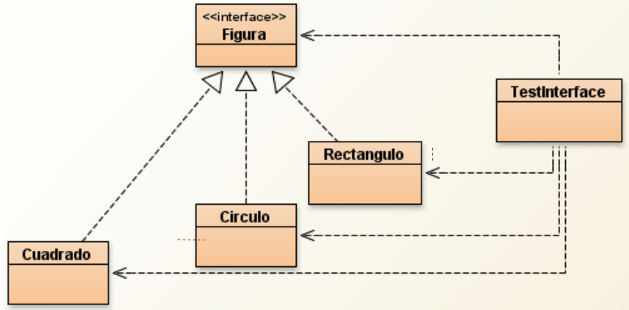

# Polimorfismo

* Es la capacidad que tienen los objetos de una clase de responder al mismo mensaje o evento en función de los parámetros utilizados durante su invocación.
* Ejemplo 1: todos los objetos responden a equals, toString, etc.
* Ejemplo 2: un celular se puede apagar, una lampara se pude apagar, ..., todos los objetos apagables se pueden apagar.


* Dos o más objetos son polimórficos respecto de un conjunto de mensajes, si todos pueden responder estos mensajes, aún cuando cada uno lo haga de un modo diferente.
* Objetos polimórficos corresponden a un mismo “tipo” de objeto -> mismo comportamiento esencial, independientemente de implementación.
* Permite que clases de distintos tipos puedan ser referenciadas por una misma variable:

```java
CuentaBancaria cuentaBancaria;
cuentaBancaria = new CajaDeAhorro();
cuentaBancaria = new CuentaCorriente();
```


* Es la clave de un buen diseño:
  * "Código" genérico.
  * Objetos desacoplados.
  * Objetos intercambiables.
  * Objetos reusables.
  * Programar por protocolo, no por implementación (buscar la esencia).

## Tipos de Binding

* **Binding Temprano o Estático**: operandos y operadores son ligados en tiempo de compilación. Es el programador quién decide qué se debe ejecutar.

* **Binding Tardío o Dinámico**: operandos y operadores son ligados en tiempo de ejecución. Es el objeto receptor del mensaje quién decide qué se debe ejecutar. La Máquina Virtual tiene que llamar a la versión del método que sea la adecuada para el tipo real del objeto al que se refiere.

## Interfaces

* Es una forma de describir lo que deberían hacer las clases sin especificar cómo deben hacerlo (protocolo de comportamiento)
* Es una colección de declaraciones de constantes y definiciones de métodos sin implementación, agrupados bajo un nombre.
* La razón de usar interfaces es que Java tiene comprobación estricta de tipos. Cuando se hace una llamada a un método, el compilador necesita ser capaz de averiguar si el método existe realmente.
* No debe crecer, si se cambia el comportamiento de una interfaz, todas las clases que la implementen fallarán.

### Declaración

```java
package nombre_paquete;
{importaciones}
[public] interface NombreInterface [extends SuperInterfaces] {
  [Constantes, por default public static final]
  [Encabezados de métodos, por default public abstract]
}
```

* Puede extender múltiples interfaces. Por lo tanto, se tiene herencia múltiple de interfaces.
* Super Interfaces es una lista de nombres de interfaces separados por coma.
* Una interfaz hereda todas las constantes y métodos de sus Super Interfaces.

### Ejemplo

```java
public interface Reseteable {
  void reset();
}
```

```java
public class Punto implements Reseteable {
  public void reset() {
    ...
  }
}
```

* Una clase que implementa una interfaz debe implementar cada uno de los métodos que están definidos en ésta.
* Una clase puede implementar una o más interfaces.

### Propiedades

* No son clases, son artefactos Java como las class, enums, etc.
* Se pueden declarar variables de tipo interfaz.  
  * Ejemplo: Reseteable reseteable;
* Las variables de tipo interfaz tienen que referirse a un objeto de tipo de una clase que implemente la interfaz.  
  * Ejemplo: reseteable = new Punto();
* Se puede usar instanceof para comprobar si un objeto implementa o no la interfaz.  
  * Ejemplo: Boolean bool = new Punto(5.0, 3.0) instanceof Reseteable;

## Ejercicios

1. En el método main de la clase TestInterface declarar un arreglo de N figuras (Interface). Las figuras pueden ser cuadrados, círculos y rectángulos. Todos responden al mensaje area. Mostrar en consola el siguiente mensaje: "De un total de N figuras, el área total es de ..."



1. Un Video Club pone a disposición de sus socios series, películas y videojuegos.
    1. Crear una clase llamada Película con las siguientes características:
        * Sus atributos son título, año, entregado, género y director.
        * Por defecto, el género es “no definido” y entregado false. El resto de atributos serán valores por defecto según el tipo del atributo.
        * Los constructores que se implementarán serán:
            * Un constructor por defecto.
            * Un constructor con el título y director. El resto por defecto.
            * Un constructor con todos los atributos, excepto de entregado.
        * Los métodos que se implementara serán:
            * Métodos get de todos los atributos, excepto de entregado.
            * Métodos set de todos los atributos, excepto de entregado.
            * Sobrescribe los métodos toString.
    1. Crear una clase llamada Serie con las siguientes características:
        * Sus atributos son título, número de temporadas, entregado, género y creador.
        * Por defecto, el número de temporadas es de 3 temporadas y entregado false. El resto de atributos serán valores por defecto según el tipo del atributo.
        * Los constructores que se implementarán serán:
            * Un constructor por defecto.
            * Un constructor con el título y creador. El resto por defecto.
            * Un constructor con todos los atributos, excepto de entregado.
        * Los métodos que se implementara serán:
            * Métodos get de todos los atributos, excepto de entregado.
            * Métodos set de todos los atributos, excepto de entregado.
            * Sobrescribe los métodos toString.
    1. Crear una clase Videojuego con las siguientes características:
        * Sus atributos son título, horas estimadas, entregado, género y compañía.
        * Por defecto, las horas estimadas serán de 10 horas y entregado false. El resto de atributos serán valores por defecto según el tipo del atributo.
        * Los constructores que se implementarán serán:
            * Un constructor por defecto.
            * Un constructor con el título y horas estimadas. El resto por defecto.
            * Un constructor con todos los atributos, excepto de entregado.
        * Los métodos que se implementara serán:
            * Métodos get de todos los atributos, excepto de entregado.
            * Métodos set de todos los atributos, excepto de entregado.
            * Sobrescribe los métodos toString.
    1. Hacer una interface llamada Entregable con los siguientes métodos:
        * entregar(): cambia el atributo prestado a true.
        * devolver(): cambia el atributo prestado a false.
        * isEntregado(): devuelve el estado del atributo prestado.
        * compareTo (Object a), compara las horas estimadas en los videojuegos y en las series el número de temporadas. y en las Películas el año
    1. Crear una aplicación ejecutable que haga lo siguiente:
        * Crea tres arrays, uno de Películas, otro de Series y otro de Videojuegos,
        * Crea un objeto en cada posición del array, con los valores que desees, puedes usar distintos constructores.
        * Entrega algunos Videojuegos y Películas y Series con el método entregar().
        * Cuenta cuantas Películas Series y Videojuegos hay entregados. Al contarlos, devuelvelos.
        * Por último, indica que Videojuego tiene más horas estimadas, la serie con más temporadas y la Película más antigua. Muéstralos en pantalla con toda su información (usa el método toString()).
